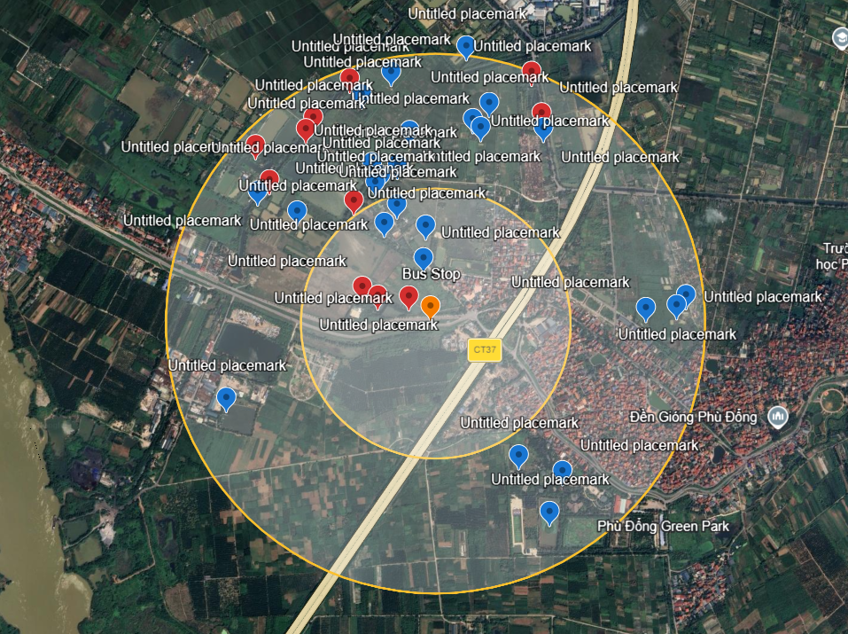
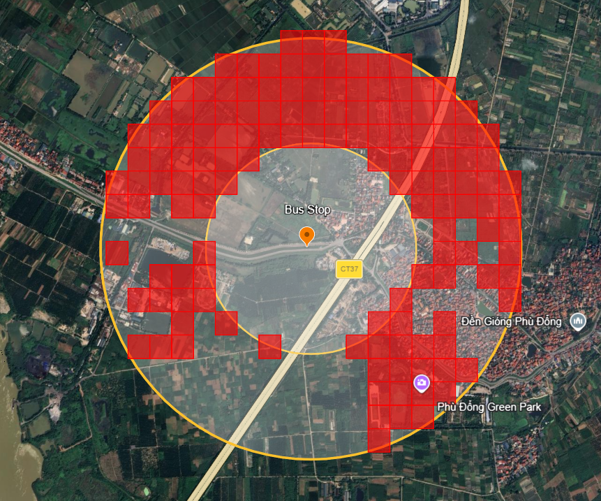
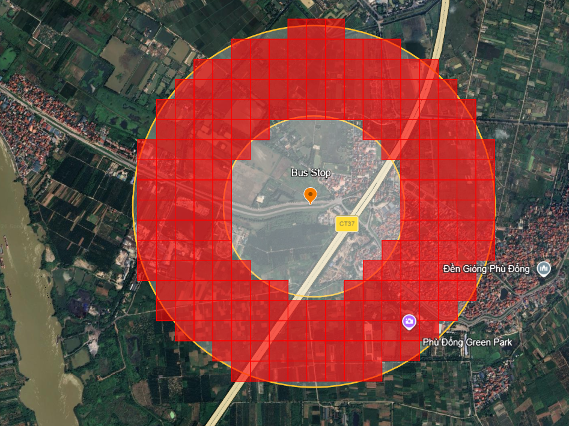
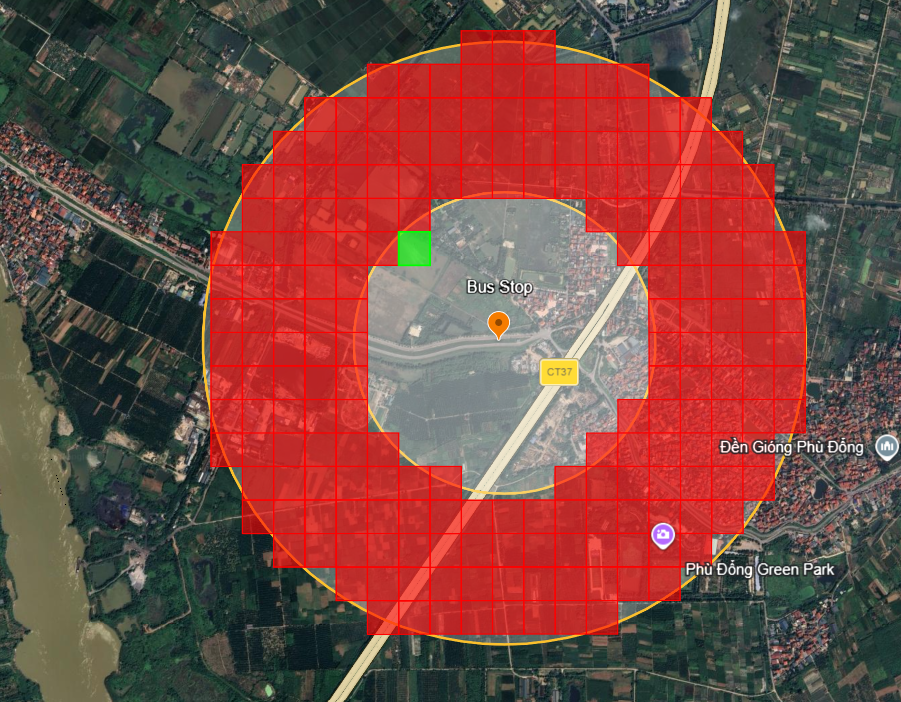

# Beauty Beauty Lake

I never go outside and touch grass, so I’ll let you guys do it for me!! Near the first location you found in Challenge 1 - Route to Nowhere, there is a beautiful lake with a small island in the middle. Some people say that monkeys even live on that island. Whatever, this place is truly worth looking at. Now, can you find the exact location of that lake?

**FLAG FORMAT:** `LYKNCTF{latitude,longitude}` The coordinates must be taken from Google Maps. Round both latitude and longitude to 3 decimal places. Use this order: latitude,longitude. Example: `LYKNCTF{64.031,175.126}`

.png>)

---

## Solution

The main hint from the admins was that the lake was near the bus stop from the challenge `Route to Nowhere`. Since the lake was supposed to have a small island in the middle, I started searching around that area on Google Maps.

The admins also said it was around 500 m to 1 km away from the bus stop, so I focused on that range first. However, that was easier said than done becasue there were around 30 possible locations that I found that fit the description. 

I ended up marking every possible point I could find and turning all of them into coordinates. I tried all of those flags, but none of them worked.

After that, I decided to just manually brute force the area. Since the flag only wanted coordinates rounded to the nearest 0.001, I could test points on a grid instead of needing the exact location down to the meter.

At first, I excluded areas that obviously did not make sense, like houses and the dry area south of the bus stop. This was the first region I tried brute forcing (118 squares):

No hits. 

At this point, I decided to just manually brute force basically the entire possible region instead:

I ended up trying over 200 points with no luck. I was pretty close to giving up because I felt like I had checked every reasonable location already.

Then I tried a few more points near the edge of the search area, and one of them finally worked. The correct location ended up being the green point here:

## Flag

`LYKNCTF{21.061,105.946}`
