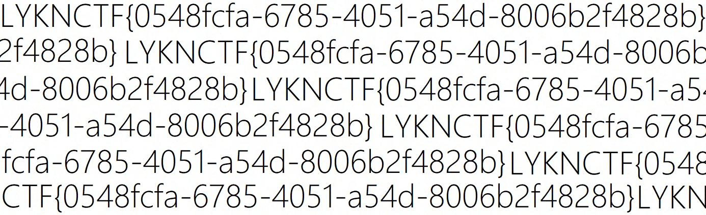

# One Stroke

## Challenge

This monochrome image doesn't seem to contain anything useful. Or perhaps you're just looking at it the wrong way.

Flag format: LYKNCTF{\<uuid>} (\<uuid> is a randomly generated UUID string.)

## Summary

This challenge ended up not being a normal metadata or byte-level stego challenge. `chall.jpg` was basically a visual pixel permutation. The RGB pixel values were still there, but the positions of the pixels were scrambled.

The main idea was to stop reading the image normally row by row. Instead, I had to follow a locality-preserving one-stroke path through the pixels. After finding the right path family and fixing the cyclic offset, the image turned into repeated readable text.

Recovered flag:

```text
LYKNCTF{0548fcfa-6785-4051-a54d-8006b2f4828b}
```

## Challenge Files

.jpg>)

```text
chall.jpg
```

Observed properties:

```text
JPEG image
Size: 1386 x 424
Pixels: 587,664
Visible content: sparse black/gray pixels on white background
```

The challenge description said the monochrome image did not seem useful, or maybe we were looking at it the wrong way. The useful admin hints were:

```text
It's just a pixel permutation.
Nearby pixels tend to stay nearby. Try following a path instead of rows.
```

Those hints were pretty important because they ruled out a lot of normal stego ideas. This kinda ruled out hidden metadata, appended files, or extracting some weird string from the bytes. The actual information was in the pixel positions.

## Solution

### Step 1: Rule out normal file hiding

I first checked the file like a normal image stego challenge:

```bash
file chall.jpg
exiftool chall.jpg
binwalk chall.jpg
strings chall.jpg | head
```

There was no useful metadata, no appended archive, and no obvious string payload. The file acted like a normal JPEG, so the useful part probably had to be in the image pixels.

Thresholding also matched what the challenge description said. The image was mostly white with a bunch of sparse dark pixels. Using grayscale thresholds gave approximately:

```text
gray < 32:   48,693 dark pixels,  8.29%
gray < 64:   56,609 dark pixels,  9.63%
gray < 96:   62,760 dark pixels, 10.68%
gray < 128:  68,448 dark pixels, 11.65%
```

That amount of dark pixels seemed pretty reasonable for black text on a white background. The colors were a little noisy because the file was a JPEG, but the important part was that the pixels themselves still looked like they could form text if placed in the right order.

### Step 2: Treat the image as a permutation

The hint `just a pixel permutation` basically means the solve should preserve the RGB values and only move pixels around. So I treated the image as one flat array of pixels:

```text
1386 * 424 = 587,664 pixels
```

Then I started testing different ways to reorder the positions.

The second hint was the real key:

```text
Nearby pixels tend to stay nearby. Try following a path instead of rows.
```

A completely random shuffle would destroy local structure. But a path-based shuffle can still keep nearby path positions spatially close. So instead of reading the pixels normally in row-major order, I tried reading them along different one-stroke or space-filling paths.

I tested these path families first:

```text
row-major
column-major
row snake / boustrophedon
column snake
diagonal zig-zag
spiral scans
Morton / Z-order
square Hilbert variants
arbitrary-rectangle Gilbert/Hilbert variants
factor reshapes of the resulting streams
```

At first, I was mostly checking the outputs visually, but that got annoying pretty fast because a lot of outputs looked vaguely structured without actually being readable.

A better way to compare candidates was to threshold the image and measure the 1D black/white transition rate along each candidate path. The correct kind of path should have longer runs of similar pixels and fewer transitions than normal raster order.

Example scoring idea:

```python
def transition_rate(binary_sequence):
    return (binary_sequence[1:] != binary_sequence[:-1]).mean()
```

Normal row-major order gave a high transition rate. Hilbert/Gilbert-style locality-preserving orders gave a much lower transition rate, which was a good sign. Even before the flag was readable, this showed that the path idea was probably right.

### Step 3: Fix the path phase

The early reconstructions looked more structured than the original image, but they still were not readable. That usually means the path family is close, but the stream is shifted.

So I treated the pixel stream as cyclic. In other words, the start of the stream might not actually be the correct visual start. If the image was written along a path and then rotated, the same pixels would all be there, but everything would be offset.

The final reconstruction came from:

1. following a locality-preserving one-stroke path through all pixels;
2. treating the result as a cyclic pixel stream;
3. rotating that stream by a golden-ratio-sized phase offset;
4. reshaping the stream back to the original image dimensions.

After that phase correction, the output became a readable repeated text image:



## Flag

```text
LYKNCTF{0548fcfa-6785-4051-a54d-8006b2f4828b}
```
