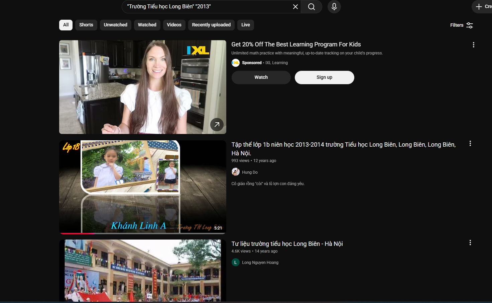
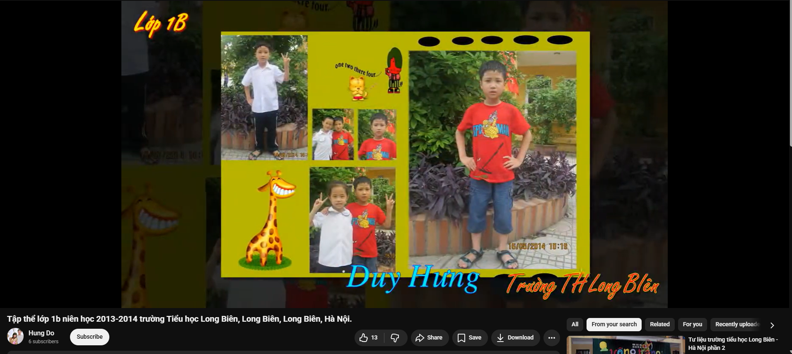
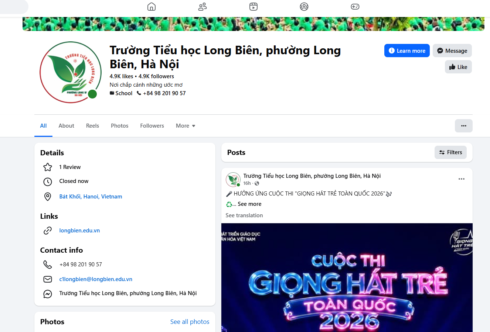
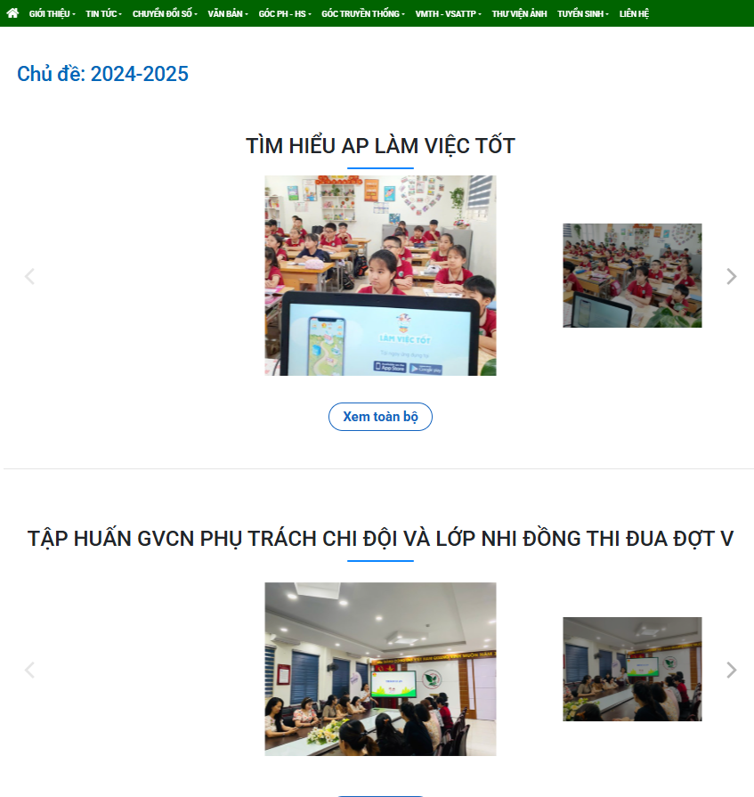
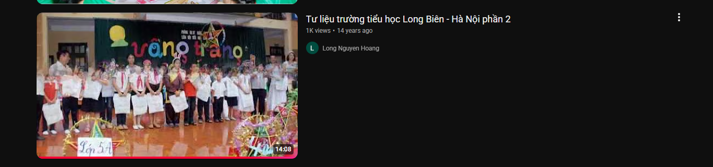
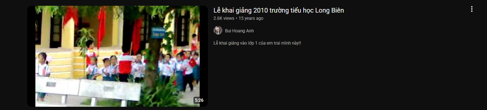
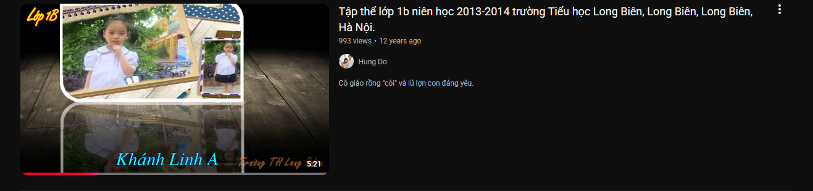

# What Does the Cat Say?

This challenge comes after solving Miss My School. I really miss my old elementary school. I was truly happy studying there. Our first-grade teacher loved her students very much, so she kept many beautiful memories of us. Somewhere on the internet, those moments are still there.

Your task is to find them, and then figure out what the cat (or tiger) is saying. Or, more simply: find the exact text written above the cartoon cat character.

**FLAG FORMAT:** `LYKNCTF{exact_text}` The flag must contain the exact text. Keep all special characters, spaces, and capitalization exactly as they appear.

Example: `LYKNCTF{!....???.//.//.any character is fine}`

---

## Solution

The school from Miss My School was **Trường Tiểu học Long Biên**, or Long Bien Primary School.

I overcomplicated this problem a lot, so I'll first explain the most direct way to solve it, and then I'll go over the route I actually took.

## Direct Solution

The most useful information was from Miss My School:

We already knew the school name was **Trường Tiểu học Long Biên**. The challenge also said: "I am 18 years old now, and I started first grade in 2013. Find the elementary school I used to attend."

So the main things to search for were:

- `Trường Tiểu học Long Biên`
- first grade / class 1
- around the 2013-2014 school year

So I searched `"Trường Tiểu học Long Biên" "2013"` on YouTube.



The first video is the video that contains the flag.

The title is **"Tập thể lớp 1b niên học 2013-2014 trường Tiểu học Long Biên, Long Biên, Long Biên, Hà Nội."** which translates to something like "Class 1B, 2013-2014 academic year, Long Bien Primary School, Long Bien District, Hanoi."

This matched basically every clue: grade 1, school, and year.

After scanning through the video, I found a cat/tiger looking cartoon character with text above it, which matched the challenge description.



So the flag was:

```text
LYKNCTF{one two there four......}
```

## The Route I Took

Since the challenge mentioned that the first grade teacher saved memories of the students, I first assumed the teacher had posted photos or videos somewhere. I also assumed the cartoon cat might be something on a classroom wall.

I went to the school website and tried to find the first grade teachers first:


I was also a little worried about the possibility that since it was 2013, the first grade teacher may have retired or transferred.

Because of that, I tried using the Wayback Machine to look at older versions of the teacher list from around 2013. That didn't really work though.


*I couldn't switch the archived page to the Grade 1 teacher list so that didnt work*

After that, I did some research and saw that Facebook was one of the most popular social media sites in Vietnam around that time. So I ended up searching through Facebook for around two hours. I scoured the school's Facebook page and also tried to find some teacher Facebook pages, but I didn't really get anywhere.



Then I went back to the school website and tried looking through photo galleries. This was pretty annoying because the site was in Vietnamese, and Google Translate wasn't working on the page. I had to manually translate small sections of text at a time.



Eventually, I gave up on that and went to YouTube. I searched only for:

```text
"Trường Tiểu học Long Biên"
```

Then I tried to find videos that were around 12-13 years old. This was kinda annoying too because YouTube does not let you filter by exact year that well.

Here are some of the videos I combed through:





Until I finally came across this:



That video finally had the cat/tiger image with the text above it.

## Flag

```text
LYKNCTF{one two there four......}
```
