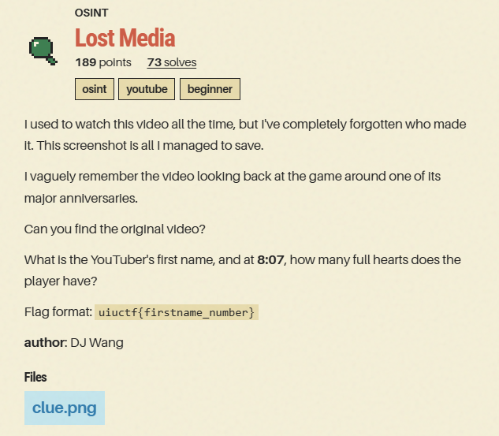
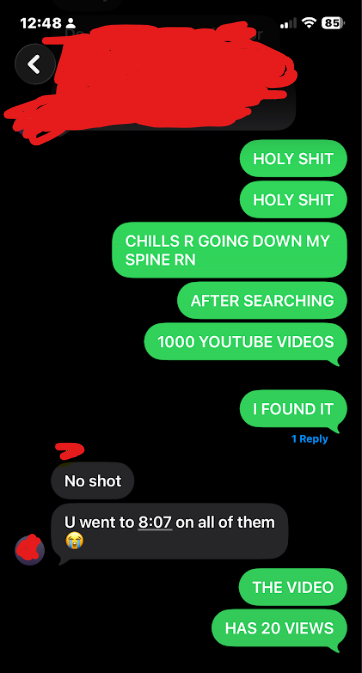
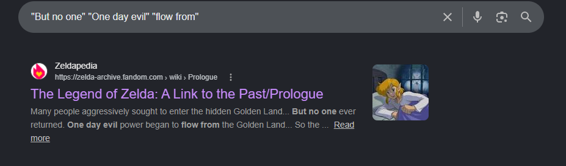
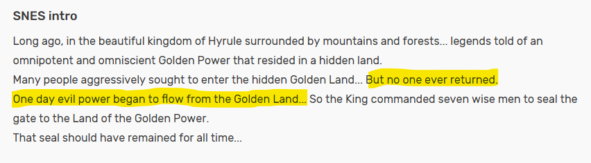
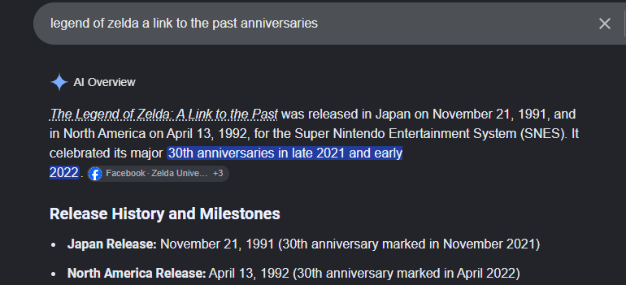
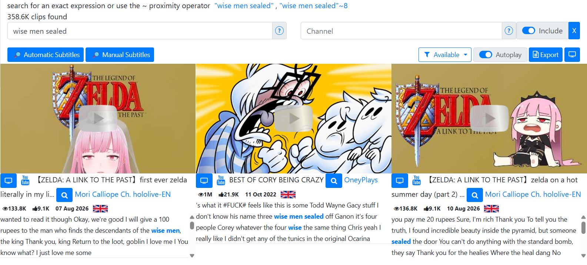
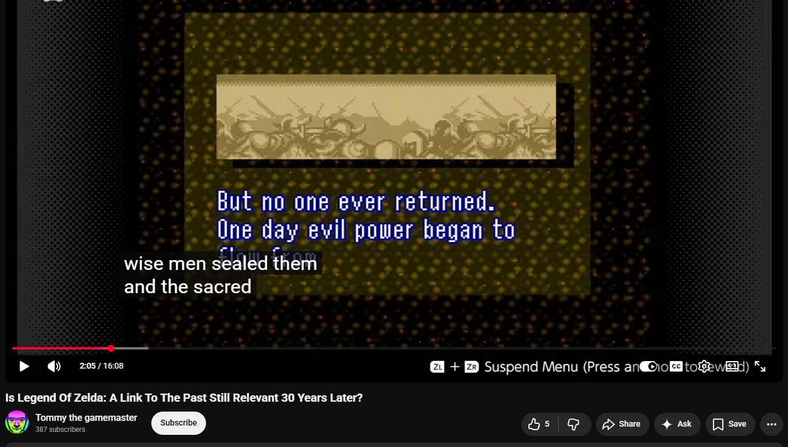
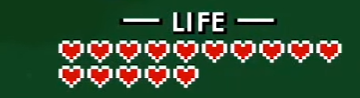

# Lost Media

<p align="center">
  
  
</p>

The challenge wants us to find a video given a small part of the frame plus some subtitles.

## My Reaction

<table>
<tr>
<td width="65%" valign="middle">

This was my reaction after finally solving it.

**Just to be clear:** I did **not** manually search through 1,000 videos. The excitement was from having to wait 20 minutes for the script to finish and I didnt have much hope of finding it.

</td>
<td width="35%" align="center">



</td>
</tr>
</table>

## Getting Info

There's not much information in the frame, but it is enough to identify the type of video it is.

Searching the text on the screen **"But no one" "One day evil" "flow from"** in Google tells you what video game this is from.

<p align="center">
  
  
</p>

The video game frame is from **The Legend of Zelda: A Link to the Past/Prologue**.

---

## The Manual YouTube Searching and More Clues

My first instinct was to just search YouTube for retrospective Legend of Zelda videos.

The challenge description said the creator was "looking back" at the game, which was why retrospective videos were very likely. It also said the video was "around one of its major anniversaries."

<p align="center">
  
</p>

This meant the video was probably around 2021/2022. But it could also be 2016/2017 or 2011/2012 for its 25th or 20th anniversary.

---

## Using the Subtitles

After getting tired of manually searching videos, the next idea was just to search the subtitles.

The phrase was **"wise men sealed them and the sacred realm now called"**. How hard can it be to find a video with a transcript containing that sentence? *(pretty damn hard)*

The first tool I used was Filmot (https://filmot.com/), which was a search engine for YouTube captions.

Putting the whole phrase gave zero results, so I tried parts of the phrase in case some of the transcript was somehow cut off or changed.

<p align="center">
  
</p>

None of the videos had the exact subtitles I was looking for. I tried some different searches including:

- "sacred realm now called"
- "wise men"
- "sacred realm"
- "wise men sealed them"

None of them worked. After doing some research, I realized Filmot does not index every YouTube transcript, particularly videos with relatively few views. (the actual video had 20 views at the time so that made sense)

So instead of using a transcript database, I decided to query YouTube videos directly...

---

## First Transcript Search Script

*(yes, "first"...)*

The idea was:

1. Search YouTube for A Link to the Past videos.
2. Download their subtitles with yt-dlp.
3. Search those subtitles for the sentence from the screenshot.
4. Fuzzy match transcripts in case it was cut off or the transcript was slightly changed. *(in hindsight I probably shouldn't have done this)*

> **Full script:** [`zelda_osint_hunter_v1.py`](zelda_osint_hunter_v1.py)

The first script searched eight queries:

- A Link to the Past retrospective
- A Link to the Past anniversary
- A Link to the Past 20th anniversary
- A Link to the Past 25th anniversary
- A Link to the Past 30th anniversary
- Zelda retrospective A Link to the Past
- A Link to the Past review years later
- A Link to the Past history

The run returned **156 unique videos**.

The script used a scoring system to determine the most likely videos. 

<details>
<summary><strong>A quick summary of how the script worked</strong></summary>

The script used yt-dlp to obtain English subtitles:

```python
opts.update({
    "writesubtitles": True,
    "writeautomaticsub": True,
    "subtitleslangs": ["en", "en-US", "en-GB", "en-orig"],
    "subtitlesformat": "vtt",
})
```

It then compared sliding transcript windows against:

```python
DEFAULT_PHRASE = "wise men sealed them and the sacred realm now called"
```

The fuzzy matching part used Python's SequenceMatcher:

```python
fuzzy = SequenceMatcher(None, target_n, nt).ratio()
```

The score also rewarded Zelda-related words:

```python
KEYWORDS = [
    "wise men",
    "sacred realm",
    "sealed",
    "seal",
    "dark world",
    "golden land",
    "ganon",
    "ganondorf",
]
```

Also, videos that were uploaded around the likely anniversary years received a small score bonus.
</details>

### The results

The script looked like it worked because it found many relevant videos at first glance.

The top result was:

> **Zelda - A Link to the Past: A Zelda Retrospective**  
> Channel: JSR_  
> Date: 2016-04-21  
> Transcript hit: 17:18

Its transcript included:

> *...the wise men could seal off the Golden land...*

The script ranked it first.

This seemed like a decent candidate because:

- it was explicitly a retrospective
- it was from 2016, which was close to the game's 25th anniversary
- the transcript discussed the wise men sealing the Golden Land

I manually opened the video and compared it against the challenge screenshot. **Nope.**

Other high-ranking candidates had the same problem. There was just too much noise: there were too many random unrelated YouTube videos.

### Fuzzy Matching screwed me

The fuzzy matching was a mistake because the words appear in many videos about A Link to the Past.

For example, a completely different video could contain:

> Ganondorf was sealed in the Sacred Realm.

That sentence contains several of our target words:

- `Ganondorf`
- `sealed`
- `Sacred Realm`

That meant the fuzzy matcher could give it a high score even though it was nowhere similar to

> seven wise men sealed them and the sacred realm now called...

I still didn't trust that the subtitles from the image were exact though...

Naturally, the next step would be to search **more videos**.

---

## Expanding the Search

I tested the search with more queries such as:

- Zelda wise men sacred realm
- Zelda wise men sealed dark world
- Zelda seven wise men Golden Land
- A Link to the Past 20th anniversary
- A Link to the Past 25th anniversary
- A Link to the Past 30th anniversary
- Zelda 20th anniversary retrospective
- Zelda 25th anniversary retrospective
- Zelda 30th anniversary retrospective

Instead of roughly 150 candidates, this run searched through **704 videos**.

This actually made the results worse.

The top result became:

> **Sage Wisdom - The Legend of Zelda: A Link to the Past (Part Six)**  
> Channel: Drew Sunn Plays  
> Date: 2025-07-18

Its matching transcript was:

> Ganon took over and then the sacred realm was sealed.

**Not even close...yet the fuzzy algorithm ranked it first.**

---

## Rethinking the Entire Strategy

The fuzzy matching transcript approach clearly was too broad, so I decided to add a constraint scoring system.

The challenge gave us several independent constraints:

### Constraint 1 - Game

It had to mention **The Legend of Zelda: A Link to the Past** in some way

### Constraint 2 - Type of video

The creator was "looking back" at the game.

Likely formats therefore included:

- retrospective
- review
- analysis
- look back
- years later
- anniversary
- history

<details>
<summary><strong>Heres how the script filtered it</strong></summary>

Positive terms included:

- retrospective
- review
- analysis
- history
- look back
- looking back
- years later
- anniversary
- legacy

Meanwhile, irrelevant formats were penalized:

- let's play
- playthrough
- walkthrough
- speedrun
- longplay
- livestream
- soundtrack
- orchestra
- concert

This was so we stopped getting random orchestra concert videos and other types of Zelda videos

</details>

### Constraint 3 - Major anniversary

I built windows around:

- 20th anniversary
- 25th anniversary
- 30th anniversary

for both its Japanese and North American releases.

<details>
<summary><strong>Heres how the script did that</strong></summary>

For example:

```python
ANNIVERSARIES = [
    ("20th JP", date(2011, 11, 21)),
    ("20th NA", date(2012, 4, 13)),
    ("25th JP", date(2016, 11, 21)),
    ("25th NA", date(2017, 4, 13)),
    ("30th JP", date(2021, 11, 21)),
    ("30th NA", date(2022, 4, 13)),
]
```

- A video within two weeks of an anniversary received the max score.
- A video several months away received much less.
- A video more than a year away received almost no anniversary credit.

</details>

### Constraint 4 - Duration

The correct video had to reach **8:07**...so anything shorter than **487 seconds** could immediately be discarded.

### Constraint 5 - Transcript structure

The narrator said these phrases in about this order:

> **"wise men"** → **"sealed"** → **"sacred realm"** → **"now called"** → **"dark world"**

The script took order into account in the scoring process. This was probably the biggest improvement

<details>
<summary><strong>heres how the script did this</strong></summary>

The script contained patterns such as:

```python
(
    "wise-seal-realm-called-dark",
    [
        r"\bwise\b",
        r"\b(?:men|man|sages?)\b",
        r"\bseal(?:ed|ing|s)?\b",
        r"\b(?:sacred\s+realm|golden\s+land)\b",
        r"\b(?:now\s+called|called|known\s+as|became|turned\s+into)\b",
        r"\bdark\s+world\b",
    ],
)
```

This meant a video with all of those words scattered all over the place would score lower.

</details>
<br>

> **Full script:** [`zelda_osint_hunter_v2.py`](zelda_osint_hunter_v2.py)

---

## FINALLY

After the script ran for around **20 MINUTES**, you can see the full results in [`ranked_candidates.csv`](ranked_candidates.csv).

The new ranking immediately placed one video above the rest:

> **Is Legend Of Zelda: A Link To The Past Still Relevant 30 Years Later?**  
> Channel: Tommy the gamemaster  
> Upload date: 2021-12-15  
> Length: 16:08

The title itself was almost a direct paraphrase of the challenge clue.

The challenge said someone was:

> looking back at the game around one of its major anniversaries

The video was literally titled:

> **Still Relevant 30 Years Later?**

Even better, it was uploaded only **24 days after the Japanese 30th anniversary**.

The script calculated:

```text
Date score:       0.950
Title score:      0.926
Metadata score:   0.942
```

<p align="center">
  
</p>

This is the exact frame of the text and subtitles. At the time, the video had 20 views, which was why it was so hard to find...

And if you go to **8:07**, it shows he has **15 health**:

<p align="center">
  
</p>

The YouTuber is called "Tommy the gamemaster", first name **"tommy"**.

Therefore the flag is:

```text
uiuctf{tommy_15}
```
