Challenge: 

Most of Belda and Bink's plans are visible to everyone. Someone involved in the handmade details knows a bit more. What is it?

https://www.zola.com/wedding/beldaandbink

This challenge was one of the harder OSINT challenges ive solved, and I was freaking out when I finally got the flag... mainly becasue I think I overcomplicated it and there was a probably an easier way. 

This was my reaction when solving it: 

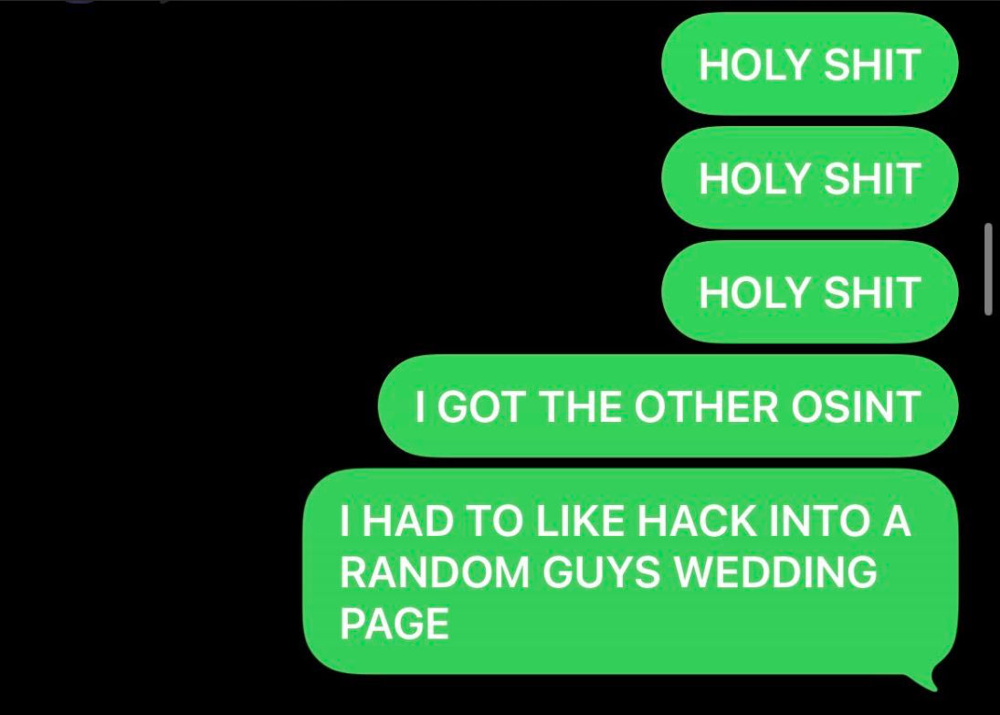

and this was my explanation to my teammate (I was high on adrenaline):

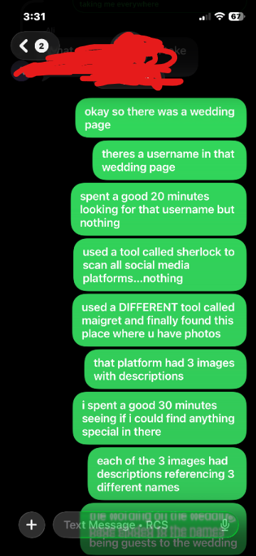
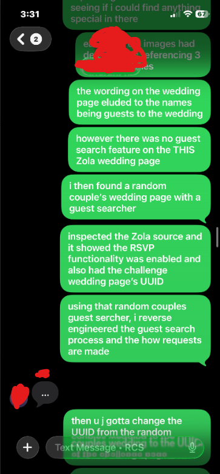
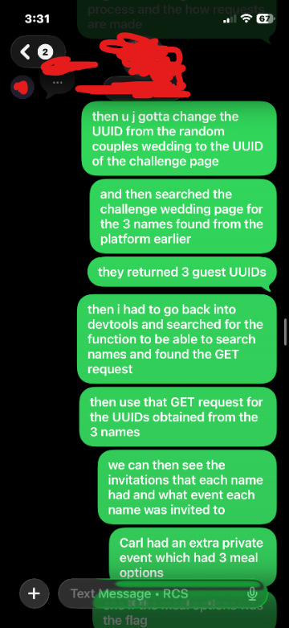

Flag search process: 

Looking Through the Wedding Website

The link takes you to a Zola wedding page. Most of the information didnt seem useful at first glance until you come across this text: 

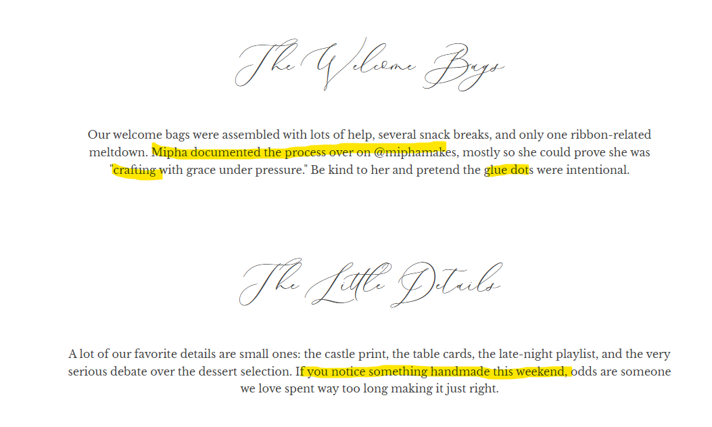

This fits the challenge description because it says someone by the name of @miphamakes was doing "something handmade"

Finding miphamakes

The natural next step would be to try to find the @miphamakes account. I expected this to be a simple instagram or tiktok account or something but nothing came up. I then used sherlock to try to search the major social media networks... still nothing. Then I tried a different username search tool, Maigret, to search the less popular sites.

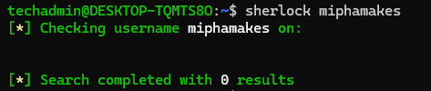
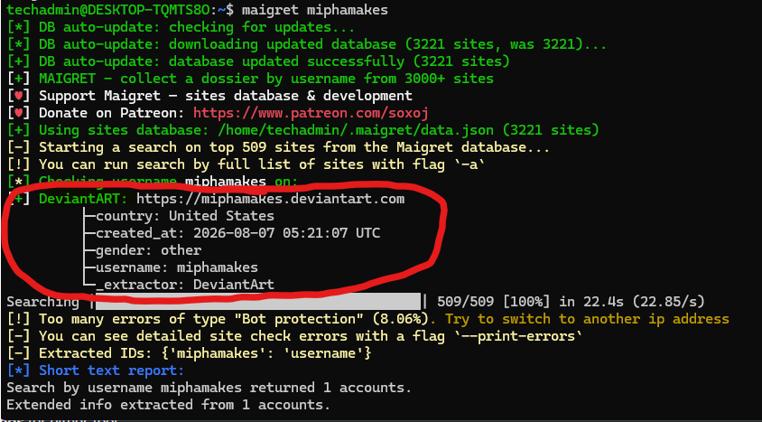

This result must be the next step...it was made the day the CTF challenge and was the only result.

The result takes you to a site called Deviant Art with 3 images posted. I was stuck here for a while. I scanned everyone who favorited/commented on the images but nothing was useful. I also tried downloading the images and doing forensics on them, but nothing came from that. 

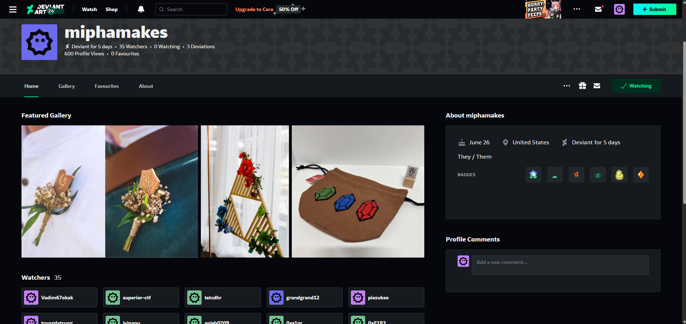

The Three Handmade Posts

I spent a good 30 minutes just scouring the DeviantArt profile trying to find something useful. The actual direction was simpler than expected...

There was 3 images with descriptions for each: 
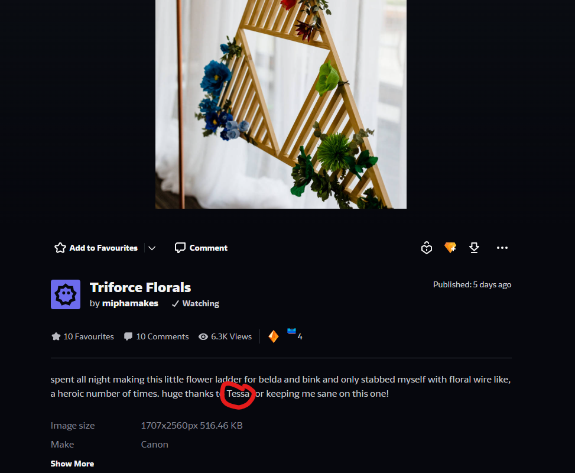
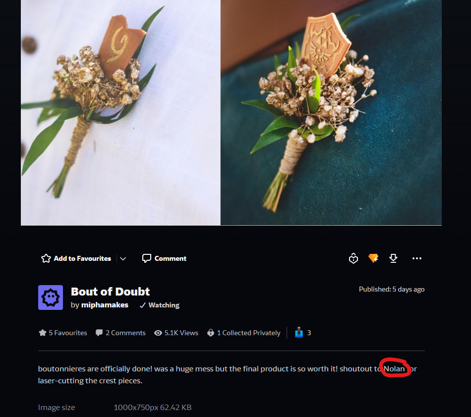
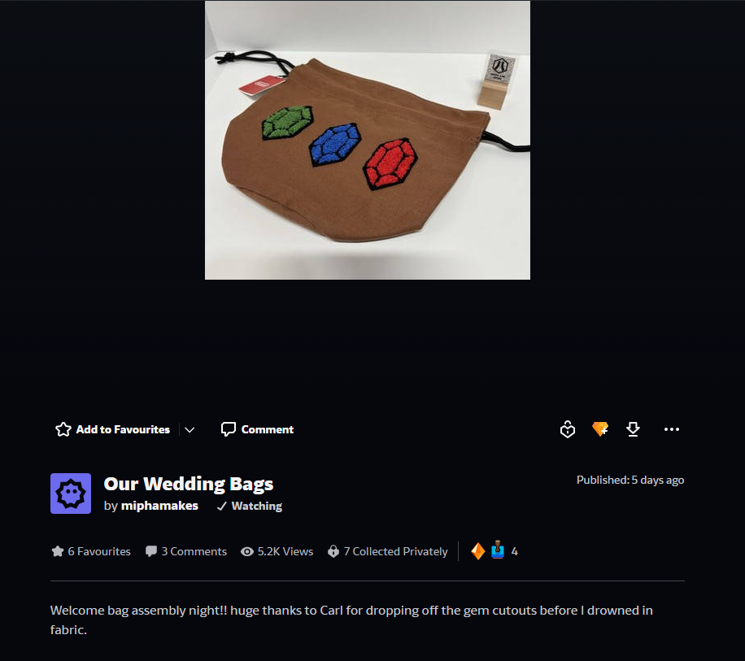

Dead Ends

I didnt really know what to do with these 3 names so before realizing what the three names were for, I investigated several other possibilities (the last one was very desperate...)
- reverse searching the handmade images
- examining DeviantArt image metadata
- looking at watchers, favorites, comments, and badge givers
- trying to identify the location in the Zola gallery photo
- searching for possible usernames based on Carl, such as carlmakes, carlcrafts, and similar variants

The social interactions were very unreliable because DeviantArt is a live platform. Watchers, favorites, comments, and badges could come from just normal users or even other CTF players

Trying username variants for Carl also produced huge numbers of unrelated real accounts. For example, CarlCrafts led to a random minecraft youtube channel. 

Then I gave up for a while, and went to give "Lost Media" a shot... which also was pretty frustrating (you can find the writeup here: UIUCTF 2026\Lost Media (OSINT)\Writeup.md) 

The big realization

After I came back, I realized that the names were probably guest names to the wedding. There were two reasons for this assumption: 
1. The descriptions imply that the names were involved in the wedding
2. Zola wedding websites have an RSVP system where guests identify themselves by entering their name
    - The challenge description said "Most of Belda and Bink's plans are visible to everyone. "

So there are 3 possible guest names: Carl, Tessa, and Nolan

Now all I had to do was figure out how Zola's guest lookup worked! Easier said than done...

Reverse Engineering Zola's RSVP Search

The Belda and Bink wedding website didnt have a RSVP interface... so I found a random public Zola wedding that had an RSVP page. 

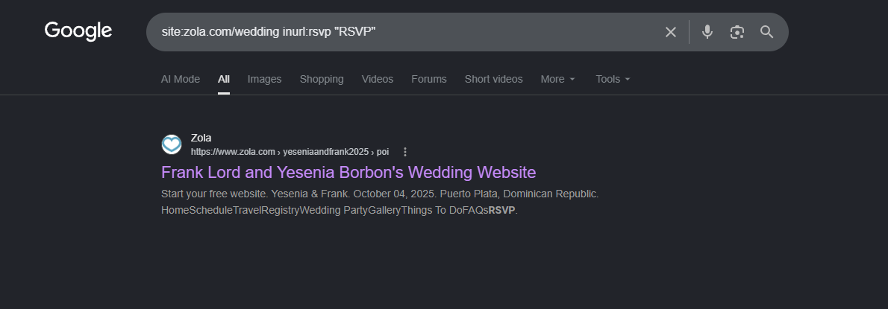
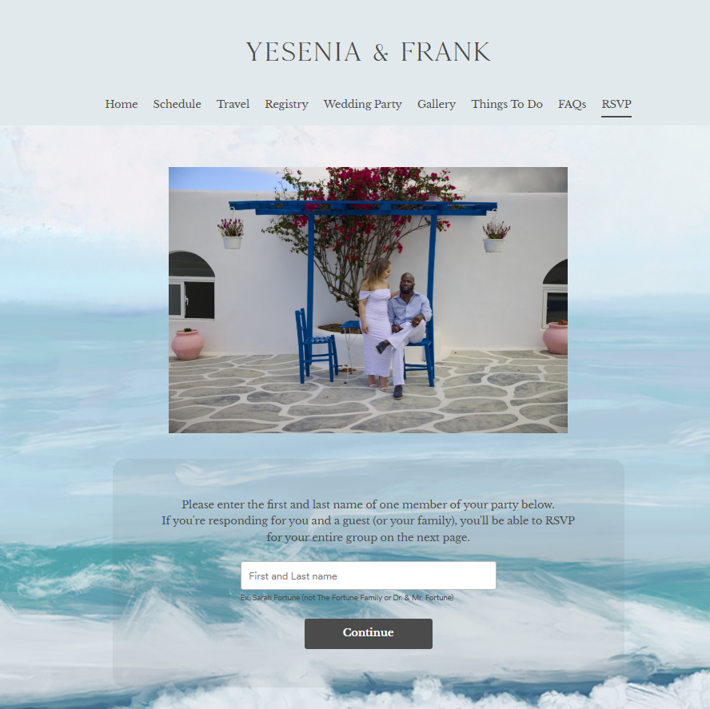

I apologize to this couple for stalking their wedding page... but I had to understand how the Zola frontend worked. 

I entered a random guest name to see how the network requests worked. 

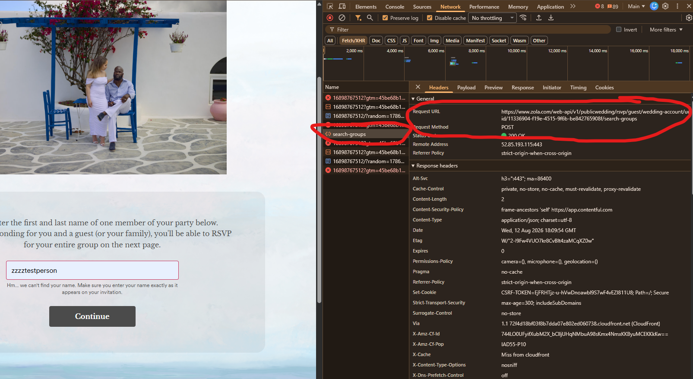
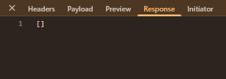

This was very interesting... the request format was 

POST /web-api/v1/publicwedding/rsvp/guest/wedding-account/uuid/<WEDDING_UUID>/search-groups

The payload was extremely simple:

{
  "guest_name": "zzzztestperson"
}

The response was:

[]

So this was how Zola's public RSVP guest search worked

Getting the UUID of Belda and Bink

This was pretty simple... just inspecting the page source of the wedding page. 

I got a little lazy because there were so many "uuid" and I was not about to search 49 instances of "uuid"

so I copy pasted the whole page source into ChatGPT and asked it to get the account UUID:

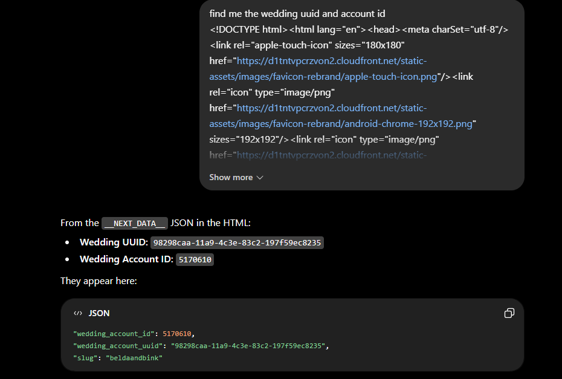

It found it: 

Wedding Account ID:
5170610

Wedding Account UUID:
98298caa-11a9-4c3e-83c2-197f59ec8235

Reproducing Guest Search

I first tried calling the endpoint directly from the DevTools console.

The initial requests returned:

403 Forbidden
Invalid request

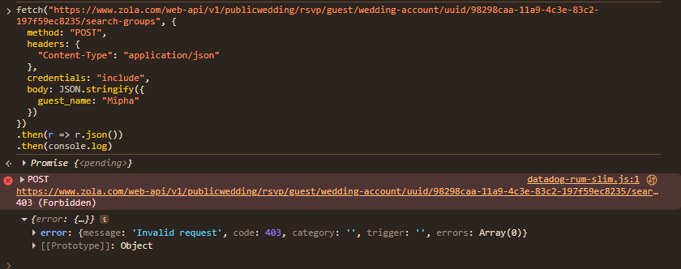

Comparing the manual request with the legitimate browser request showed that the original request contained an x-csrf-token header.

The CSRF value could be read from Zola's CSRF-TOKEN cookie:

const csrf = decodeURIComponent(
  document.cookie
    .split("; ")
    .find(x => x.startsWith("CSRF-TOKEN="))
    ?.split("=")[1] || ""
);

console.log(csrf);

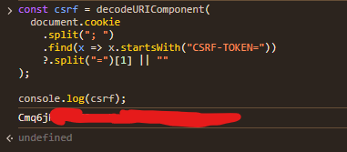

Then I created a helper:

async function searchGuest(uuid, name) {
  const r = await fetch(
    `https://www.zola.com/web-api/v1/publicwedding/rsvp/guest/wedding-account/uuid/${uuid}/search-groups`,
    {
      method: "POST",
      headers: {
        "Content-Type": "application/json",
        "x-csrf-token": csrf
      },
      credentials: "include",
      body: JSON.stringify({
        guest_name: name
      })
    }
  );

  const text = await r.text();

  console.log({
    name,
    status: r.status,
    response: text
  });
}

I tested it:

searchGuest(
  "98298caa-11a9-4c3e-83c2-197f59ec8235",
  "zzzztestperson"
);

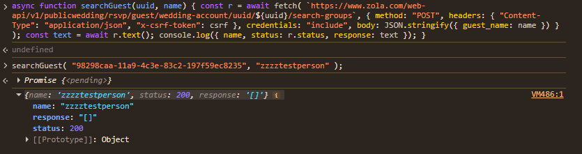

Result:

status: 200
response: []

This meant that the request was being reproduced correctly and the challenge wedding supported the same guest-search API!

Searching the Names From DeviantArt

I then tried searching the 3 names from the descriptions to see if they appear on the RSVP guest list for the challenge website. 

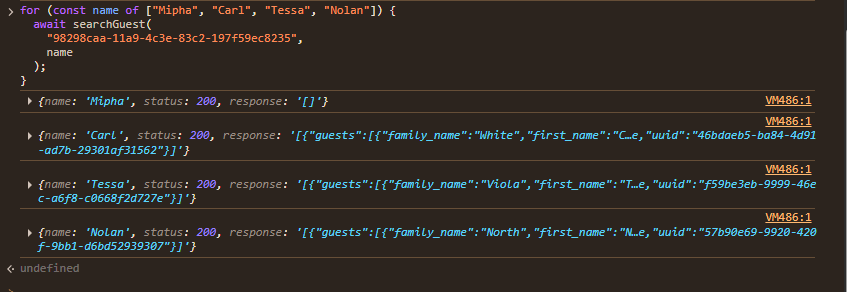

That was a huge breakthrough. The three names from the posts were actual guests in the challenge wedding. 

Gathering more info

The search-groups endpoint only gave names and UUIDs. We still needed to know what wedding information each guest could see.

Instead of guessing endpoints, I inspected Zola's own frontend JavaScript. I searched for "search-groups" and found this: 

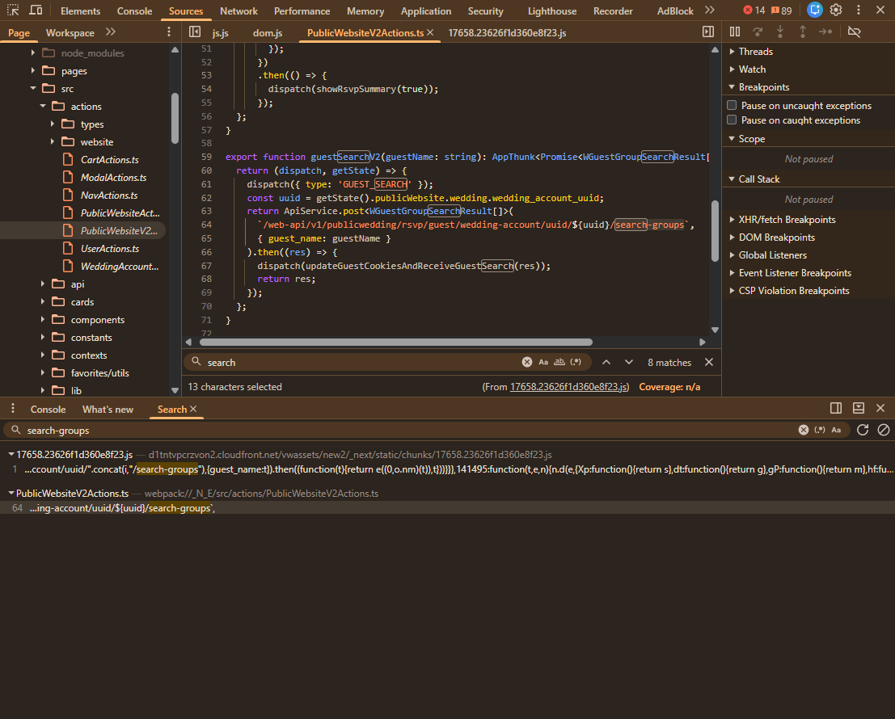

This was the function Zola calls when searching a for a guest:

export function getRsvpByGuestGroupUuidV2(
  guestGroupUuid: string
): AppThunk<Promise> {
  return (dispatch, getState) => {
    dispatch(requestGuestRsvp());

    const weddingAccountUuid =
      getState().publicWebsite.wedding.wedding_account_uuid;

    return ApiService.get(
      `/web-api/v2/publicwedding/rsvp/guest-group/uuid/${guestGroupUuid}/wedding-account/uuid/${weddingAccountUuid}`
    ).then((response) => {
      ...
    });
  };
}

So the read-only endpoint was:

GET /web-api/v2/publicwedding/rsvp/guest-group/uuid/<GROUP_UUID>/wedding-account/uuid/<WEDDING_UUID>

Reading the Guest's Wedding Events

I made another helper:

async function getRsvp(groupUuid) {
  const weddingUuid =
    "98298caa-11a9-4c3e-83c2-197f59ec8235";

  const r = await fetch(
    `https://www.zola.com/web-api/v2/publicwedding/rsvp/guest-group/uuid/${groupUuid}/wedding-account/uuid/${weddingUuid}`,
    {
      method: "GET",
      credentials: "include"
    }
  );

  const text = await r.text();

  console.log({
    status: r.status,
    response: text
  });

  return text;
}

Then queried all three groups:

const groups = {
  Carl: "46bdaeb5-ba84-4d91-ad7b-29301af31562",
  Tessa: "f59be3eb-9999-46ec-a6f8-c0668f2d727e",
  Nolan: "57b90e69-9920-420f-9bb1-d6bd52939307"
};

for (const [name, uuid] of Object.entries(groups)) {
  console.log(`===== ${name} =====`);
  await getRsvp(uuid);
}

All three requests returned:

200 OK

The responses contained:

guests
event_invitations
events
meal_options
rsvp_questions

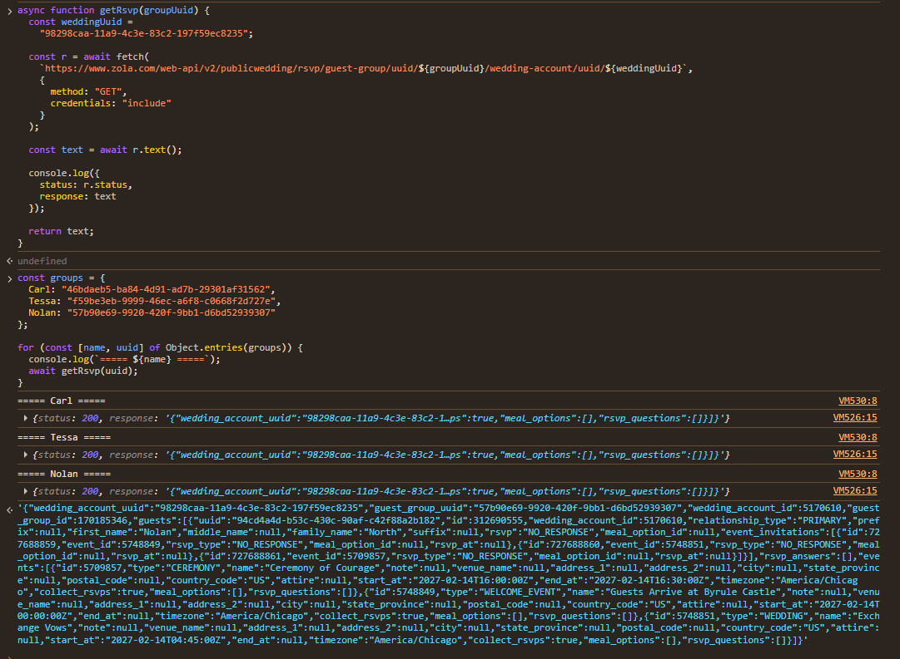

That contained a lot of info...surely the flag had to be somewhere...

Searching "uiuctf", and you find the flag under one of Carl's meals!

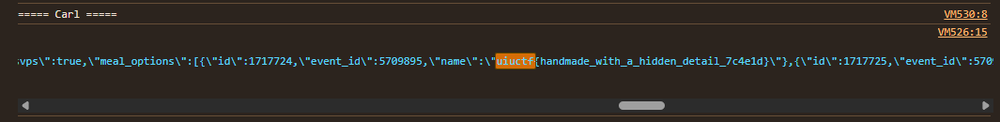

flag: uiuctf{handmade_with_a_hidden_detail_7c4e1d}