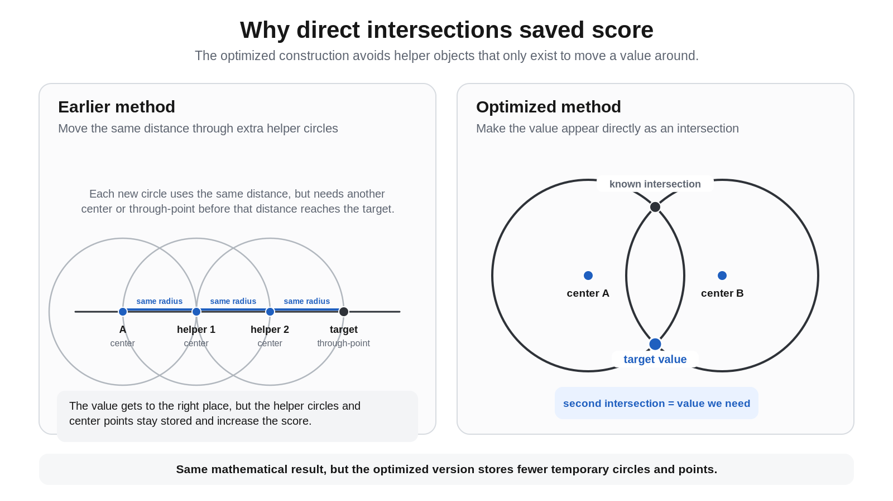

<h1 align="center">n-force, but following the rules</h1>

<p align="center"><strong>The LEGIT 17-, 257-, and 65,537-gon constructions for UIUCTF 2026, plus the line-only bug and optimization</strong></p>
<p align="center"><strong>Written by cornballs</strong></p>

---

`n-force` was a geometry optimization challenge where the goal was to construct a regular polygon using a very limited set of straightedge-and-compass commands. We started with only two points, \(O=(0,0)\) and \(P=(1,0)\), and every new point, line, or circle had to be constructed from objects that already existed. The score counted all of the geometric objects stored by the parser, so the goal was to make a correct construction using as few objects as possible.

The parser had several bugs, and most of the lowest scores on the leaderboard relied on behavior we did not consider legitimate under the intended geometry rules. I expected the organizers to fix the parser bugs and remove the invalid scores, so I did not spend time looking for those parser workarounds. They later said they were not going to remove the invalid submissions. As a result, the scores in this writeup are not necessarily the lowest scores you will see in other writeups; they are the legitimate exact constructions we produced.

The line-only challenges ended up being a completely different issue. The deployed parser was internally inconsistent. Under the literal rules, there was no legal way to create a third point. We eventually proved that the legitimate feasible set was empty, tested it against the live submission service, and asked the organizers about it. They confirmed that a starting-circle setup had been intended and later said that the bug was known and that the parser would not be fixed.

Since I do not have a degree in math, almost all of the math in the technical sections was done by ChatGPT 5.6 Sol. As a high schooler, I do not fully understand every part of the mathematics, which is why I wrote the nontechnical explanations and let AI handle most of the technical derivations.

For the circle-only challenges, you needed to know more than the fact that a regular 17-gon or 257-gon is constructible. We had to take the algebra behind those constructions and turn it into parser commands. You could not just set the radius of a circle to a number; its center and a point on the circle both had to already exist. Every intersection also created stored points, including the second intersection even when we did not need it. This meant that basic operations such as copying a radius, taking a midpoint, reflecting a point, or solving a quadratic all contributed to the score.

The unrestricted 65,537-gon was the same basic problem, except way bigger. We had to turn the fact that

\[
65537=2^{16}+1
\]

is constructible into a deterministic geometry program with **300,037 executable commands**. The accepted file stored **373,615 geometric objects**. Generating all 65,537 vertices looked like it should be the ridiculous part, but it was not even the hardest part. A huge amount of the work went into constructing **one exact primitive root of unity** cheaply enough to start the final walk around the circle.

The main idea behind all three actual polygon constructions was pretty simple:

> [!IMPORTANT]
> **This writeup is REALLY long**
>
> This writeup consists of all the n-force challenges, which makes it extremely long. For grading this writeup, I suggest using the roadmap below or the individual writeups for each challenge, which are copy pasted from this writeup. This writeup involves a lot of complex math, some of which I dont fully understand. For each challenge, I wrote the non-technical section, while AI handled all the technical stuff. 

<a id="roadmap"></a>
## Roadmap and quick links

This writeup is long, so this section is meant to make it easier to jump around. If you mainly want to understand the constructions without going too far into the math, start with the **Less technical explanation** under each polygon. If you want the exact construction or optimization details, the links below go directly to those sections.

### Challenge setup

[**Part I: Challenge model**](#part-i) explains the parser, scoring system, exactness standard, and the basic idea behind all three constructions.

- [Final legitimate results](#final-results)
- [Parser and scoring](#parser-scoring)
- [Non-technical overview](#beginner-overview)
- [Exactness standard](#exactness-standard)
- [How the work progressed](#work-progressed)

### 17-gon, circle only

[**Part II: 17-gon, circle only**](#part-ii) is the smallest construction and probably the best place to start if you want to understand the actual geometry. The main idea is to build a few exact values, use circle intersections to get the first roots, and then generate the rest of the polygon from those.

- [Less technical explanation](#17-less-technical)
- [Final accepted result](#17-result)
- [Construction steps](#17-construction)
- [Optimization history](#17-optimization)
- [Why exact scores 27 and 28 are impossible](#17-lower-bound)

### 257-gon, circle only

[**Part III: 257-gon, circle only**](#part-iii) uses the same general idea at a much larger scale. This is where the Gaussian-period dependency tree and compiler-style optimization become much more important.

- [Less technical explanation](#257-less-technical)
- [Final accepted result and lower bound](#257-result)
- [Construction steps](#257-construction)
- [Optimization history](#257-optimization)
- [Exact verification](#257-verification)
- [Post-solve research](#257-postsolve)

### 65,537-gon, unrestricted

[**Part IV: 65,537-gon, unrestricted**](#part-iv) is the largest construction by far. Most of the difficulty was constructing one exact primitive step cheaply enough. After that, the remaining 65,534 vertices come from repeating a simple chord construction.

- [Less technical explanation](#65537-less-technical)
- [Final accepted result](#65537-result)
- [Construction steps](#65537-construction)
- [Score breakdown](#65537-score)
- [Optimization history](#65537-optimization)
- [Exact lower bounds](#65537-lower-bounds)
- [Verification](#65537-verification)
- [Post-contest seed optimization](#65537-postcontest)

### Line-only bug

[**Part V: The line-only bug**](#part-v) explains why the deployed line-only version could not legitimately construct even a third point. This part is separate from the polygon constructions because it ended up being an impossibility proof rather than a solve.

- [Bootstrap deadlock proof](#line-bootstrap)
- [Live parser tests](#line-live-tests)
- [Organizer clarification](#line-organizer)

### Deadline and reproduction

[**Part VI: Deadline and reproduction**](#part-vi) explains why the final optimization effort shifted toward the 65,537-gon seed and lists the files needed to reproduce each accepted result and the line-mode analysis.

- [What the deadline changed](#deadline-changed)
- [Reproduction scripts/files](#reproduction-map)
  - [17-circle files](#repro-17)
  - [257-circle files](#repro-257)
  - [65,537 unrestricted files](#repro-65537)
  - [Line-mode analysis files](#repro-line)

---

<a id="part-i"></a>
## Part I - Challenge model

<a id="final-results"></a>
### Final legitimate results

The three final polygon constructions were exact, verified, and accepted by the contest checker:

| instance | status | score | executable lines | key object counts |
|---|---|---:|---:|---|
| 17-gon, circle only | **verified + accepted exact construction** | **153** | **109** | 65 circles, 43 CC intersections, 88 points |
| 257-gon, circle only | **verified + accepted exact construction** | **2,149** | **1,529** | 909 circles, 619 CC intersections, 1,240 points |
| 65,537-gon, unrestricted | **verified + accepted exact construction** | **373,615** | **300,037** | 218,352 points, 78,264 lines, 76,999 circles |
| 17-gon, line only | no legitimate construction exists under deployed semantics | N/A | N/A | bootstrap deadlock |
| 257-gon, line only | no legitimate construction exists under deployed semantics | N/A | N/A | bootstrap deadlock |

---

<a id="parser-scoring"></a>
### Parser and scoring

Every construction begins with only

\[
O=(0,0),\qquad P=(1,0).
\]

The unrestricted language supports the usual object constructors:

```text
line A B L
circle A B C
meets_line_line L1 L2 X
meets_line_circle L C X Y
meets_circle_circle C1 C2 X Y
n_gon P ...
```

The most important parser detail is what a circle command actually means:

```text
circle A B C
```

creates the circle centered at the already-existing point `A` and passing through the already-existing point `B`.

There is no command such as

```text
circle center=A radius=r
```

and there are no coordinate literals.

If the mathematics tells us that a new circle should have radius \(\sqrt{17}\), that is not enough. We need an already-constructed point \(B\) such that the distance from the desired center \(A\) to \(B\) is exactly \(\sqrt{17}\). Constructing that witness may cost more than constructing the circle itself.

The score is

\[
\boxed{
\text{score}
=
\#\text{stored points}
+
\#\text{stored lines}
+
\#\text{stored circles}
}.
\]

Intersection arity matters:

- `meets_line_line` creates one stored point;
- `meets_line_circle` creates two;
- `meets_circle_circle` creates two.

For circle-only mode, if \(c\) circles and \(i\) circle-circle intersections are used, then

\[
\#\text{points}=2+2i
\]

and therefore

\[
\boxed{\text{score}=2+c+2i}.
\]

A compact circle-only file using only circle commands, CC commands, and the final polygon command has

\[
\boxed{L=c+i+1}
\]

executable lines.

Those two equations were useful for optimizing our own files and also for sanity-checking leaderboard rows.

---

<a id="beginner-overview"></a>
### Non-technical overview

The later sections get into Gaussian periods, quadratic fields, exact geometry, and a bunch of compiler details. Before that, this is the simpler version of what the construction was doing.

Every successful polygon basically had three parts:

```text
construct one exact starting value
        ↓
use it to get the first neighboring vertices
        ↓
repeat a simple geometric step to get the rest
```

Almost all of the hard math was in the first part.

#### The main restriction: numbers have to become geometry

The parser does not let us type coordinates or numerical radii.

We only start with

\[
O=(0,0),\qquad P=(1,0).
\]

After that, everything has to come from points, lines, circles, and intersections that already exist.

So if the math tells us that we need the point

\[
(5,0),
\]

we cannot just write `5`.

If we need a circle of radius

\[
\sqrt{17},
\]

we also cannot just write `sqrt(17)`. We need a point that is already exactly \(\sqrt{17}\) away from the center.

This means there are essentially two separate problems:

1. figure out the exact mathematical value we need
2. figure out a cheap legal geometry construction that creates that value.

A lot of the optimization involved finding clean algebraic formulas that sometimes turned out to be terrible geometric constructions.

---
The rest of this overview introduces the technical structure step by step.

#### Step 1: construct one exact step around the polygon

A regular \(n\)-gon on the unit circle can be written as

\[
1,\zeta,\zeta^2,\ldots,\zeta^{n-1},
\]

where

\[
\zeta=e^{2\pi i/n}.
\]

You do not really need the complex-number notation to understand what this means. Put \(n\) equally spaced points on a circle. Start at

\[
P=(1,0).
\]

Then \(\zeta\) is just the next vertex counterclockwise.

So the hard part of each challenge can be reduced to:

> How do we start from only \(O\) and \(P\) and construct the exact next vertex?

For 17, 257, and 65,537, this is possible because all three are Fermat primes.

The algebra in the technical sections is basically the machinery that lets us construct the x-coordinate

\[
2\cos\frac{2\pi}{n}
\]

exactly. Once we have that value, getting the actual point on the unit circle is much easier.

---

#### Step 2: make the quadratic happen directly as geometry

A pattern that comes up over and over is this:

We know two unknown values \(A\) and \(B\), but instead of knowing them individually, we know

\[
A+B=S
\]

and

\[
AB=P.
\]

That means \(A\) and \(B\) are the two roots of

\[
x^2-Sx+P=0.
\]

The obvious algebraic method is the quadratic formula. But compiling the quadratic formula into this parser would mean building the discriminant, taking a square root, adding and subtracting values, and dividing by two. That gets expensive really fast.

Instead, we tried to set up two circles so that their two intersection points directly had the x-coordinates \(A\) and \(B\).

That ended up being one of the most useful ideas in the whole challenge:

> [!IMPORTANT]
> **If an intersection is going to create two points anyway, try to make both of them useful.**

For the 17-gon, this saved a lot of helper geometry. The 257 compiler generalized the same idea, and the 65,537 construction used related quadratic geometry at a much larger scale.

---

#### Step 3: once neighboring vertices exist, walking around the circle is easy

Suppose two neighboring vertices already exist:

```text
R_(k-1)
R_k
```

Draw a circle centered at \(R_k\) and passing through \(R_{k-1}\).

Its radius is exactly one side length of the regular polygon.

Now intersect that side-length circle with the main circumcircle. There are two intersections:

```text
R_(k-1)    ← the old vertex
R_(k+1)    ← the next vertex
```

So the same two-command pattern can keep moving around the polygon.

For 257, we use this after constructing the first primitive root pair.

For 65,537, we repeat it **65,534 times**.

That sounds like it should dominate the whole score. It costs a lot, but one of the weird parts of this challenge was that constructing the initial exact root could be almost as expensive.

---

#### Step 4: score the objects the parser actually stores

A normal geometry proof usually does not care about temporary helper objects.

`n-force` does.

Every stored point, line, and circle counts.

So something that is “one standard construction” in a geometry textbook could actually mean:

- several helper circles;
- several extra intersections;
- several useless points that still stay stored.

For example, copying a radius sounds simple. But if the parser makes us build a whole compass-transfer gadget just to do it, that gadget has a real score.

This is why a lot of the 17-gon improvement came from replacing general-purpose radius-copy constructions with direct incidences that happened to create exactly the point we wanted.

---

#### Step 5: stop constructing values that the final answer never uses

This was probably the biggest lesson from the 257-gon.

The obvious Gaussian-period hierarchy has

\[
127
\]

quadratic splits.

At first, our compiler basically built all of them.

But we only need one final value:

\[
2\cos\frac{2\pi}{257}.
\]

So we started from that value and worked backward through its dependencies.

After pruning everything that did not matter, only

\[
24
\]

quadratic splits were actually needed.

That was a much bigger improvement than trying to save one or two circles inside each quadratic gadget.

The same idea mattered even more for 65,537. We tracked the exact dependency DAG and reused identical algebraic or geometric work whenever possible.

---

#### Step 6: profile the construction instead of guessing what is expensive

After getting something correct, we counted where the score was actually going.

For the final 17-gon:

```text
seed/algebra     111 score
vertex tail       42 score
total            153 score
```

For the final 257-gon:

```text
primitive-root prefix   1,382 score
vertex generation         765 score
initial points               2
total                     2,149
```

For the accepted 65,537-gon:

```text
primitive-root frontend   177,013
vertex orbit              196,602
total                     373,615
```

And inside that 65,537 frontend:

```text
weighted-average geometry 142,605
```

That number changed what we worked on.

There was not much point saving a few commands from the final orbit if weighted averages were using more than 140,000 score before the orbit even started.

So the process became:

```text
build something exact
        ↓
measure the score
        ↓
find the actual bottleneck
        ↓
change the math or representation around that bottleneck
```

---

#### Step 7: do not treat one numerical checker run as the proof

The final files, especially the 65,537 one, are way too large to trust just because one parser run says `valid`.

We separated the proof from the numerical execution.

The important pieces were:

```text
exact algebraic identities
        +
exact Euclidean identities
        +
dependency checks
        +
high-precision independent replay
```

The exact math explains why the construction should be correct.

The high-precision replay is more like a check that the code generator followed that math correctly and did not accidentally choose the wrong intersection branch somewhere.

This was especially important for 65,537, because one bad branch deep in the construction could mess up hundreds of thousands of later commands.

---

#### The entire idea in one diagram

```text
                 EXACT MATH
                     │
                     │  figure out the primitive step
                     ▼
          quadratic / Gaussian-period plan
                     │
                     │  remove unused dependencies
                     ▼
              optimized algebra DAG
                     │
                     │  compile each operation
                     ▼
          lines / circles / intersections
                     │
                     │  get the first neighboring roots
                     ▼
              first polygon vertices
                     │
                     │  repeat the chord rule
                     ▼
               all polygon vertices
                     │
                     ▼
                  n_gon
```

The complicated number theory is mostly above the middle.

The huge command count is mostly below the middle.

Most of our optimization work was trying to make the connection between those two parts cheaper.

---

<a id="exactness-standard"></a>
### The exactness standard

One decision that ended up mattering a lot was that we treated `n-force` as an **exact Euclidean construction problem**, not just “make a file that passes the checker once.”

The checker obviously has to evaluate coordinates numerically. But if we were going to claim that we legitimately constructed a regular 17-, 257-, or 65,537-gon, I wanted the construction itself to be mathematically exact.

So our standard was:

- important geometric identities should have exact derivations;
- algebraic roots should come from exact polynomial relations;
- reused circles should be proved to be the same circle, not just numerically close;
- branch choices should be justified and stable;
- increasing the numerical precision should make the residual error smaller instead of exposing a fixed geometric error.

This also changed how we looked at leaderboard scores.

Some extremely low score/line pairs did not even look possible under basic exact incidence counting. Instead of assuming every visible score represented an exact construction that we needed to beat, we first asked:

> **Could an exact Euclidean construction with those object counts even exist?**

For the 257-circle challenge, for example, an exact incidence argument gives

\[
c\ge129
\]

construction circles.

A row such as `277 / 146`, under the observed line accounting, would imply at most

\[
c\le2(146)-277=15,
\]

which is nowhere close to the exact minimum.

For the unrestricted 65,537-gon, a similarly simple argument gives

\[
\text{score}\ge98,306
\]

and

\[
\text{executable lines}\ge65,538.
\]

These bounds helped separate two different questions:

1. What can the implementation be made to accept?
2. What can actually be constructed in exact Euclidean geometry?

This writeup is mainly about the second one.

We still used numerical replay a lot. It was useful for catching generator mistakes, unstable intersection ordering, and accidental degeneracies. But I would not treat a precision sweep by itself as the proof that the polygon is exact. The exact algebra and geometry are the proof; the replay checks the implementation.

---

<a id="work-progressed"></a>
### How the work actually progressed

Before getting into each construction, this is roughly how the solving process went.

#### Phase 1: get any complete exact construction

At first, the goal was just to make the full pipeline work.

For 17 circles, we started with a fairly direct Gérard-style compass construction that scored 202.

For 257 circles, the first general exact compiler built the full Gaussian-period hierarchy using generic compass arithmetic. It scored **37,004**.

For 65,537 unrestricted, the first complete frontend plus vertex walk was above **520,000** score.

These were intentionally overbuilt. I mostly wanted to know that the math could actually be compiled all the way into legal parser commands before worrying too much about score.

#### Phase 2: optimize the dependencies, not just the gadgets

The first really big 257 improvement had almost nothing to do with better circle tricks.

A full 257 Gaussian-period tree contains 127 quadratic splits. But the final goal is only one value:

\[
2\cos\frac{2\pi}{257}.
\]

So we worked backward from that value and asked which earlier periods were actually needed.

That reduced the hierarchy from **127 splits to 24**.

The score dropped from 37,004 to 8,255 before most of the local geometry had even been optimized.

The same thing happened at 65,537 scale. Generic arithmetic was too expensive. We needed an exact dependency DAG, global common-subexpression elimination, and a compiler that understood what the algebraic objects actually represented.

#### Phase 3: make both intersection outputs useful

A circle-circle intersection always returns two points.

If one point is useful and the other one is garbage, we still pay for both.

So for 17 and 257, we started looking for constructions where the two roots of an algebraic quadratic were literally the two points created by one geometric intersection.

That led to the direct sum/product quadratic solvers, reflection reuse, and some of the pair-harvesting ideas later on.

For 17, these changes helped take the construction from 202 to 153.

For 257, replacing explicit discriminant/square-root arithmetic with direct quadratic geometry was one of the main steps on the way to 2,149.

#### Phase 4: the vertex-generation suffix becomes the next problem

Once we had a primitive root, both 257 and 65,537 could use a simple equal-chord walk around the unit circle.

That walk is exact and easy to prove, but it wastes one output of every circle-circle intersection. Each step creates two parser points even though only one of them is a new polygon vertex.

For 257, the final walk costs 765 score.

For 65,537, it costs **196,602**.

So we tried a bunch of alternatives: pair harvesting, reciprocal rings, productive transversals, mutual-witness networks, and other designs where both outputs would hopefully do useful work.

Some of these looked really good as abstract incidence diagrams. The problem was that they were much harder to turn into an actual legal `.geo` file because every circle center and every radius witness also had to be constructed first.

#### Phase 5: realize line-only is actually broken

The line-only problem looked weird from the beginning.

The parser required the first command to be a circle, but after that it banned circle operations and circle intersections. The first circle creates no new point, so the only points left are still \(O\) and \(P\).

That means every legal line is just the line \(OP\), and no line-line intersection can create a third point.

At that point this stopped being an optimization problem. It became an impossibility proof.

We tested the behavior against the live service and then asked the organizers. They confirmed that a starting-circle setup had been intended and that the deployed behavior was a known bug.

#### Phase 6: put the remaining effort into the 65,537 seed

By the end, the three main constructions were in very different states:

- 17-circle was already down to 153;
- 257-circle was down to 2,149, but getting anywhere near the 387 incidence bound needed a completely different architecture;
- line-only had no legitimate construction under the deployed parser;
- 65,537 still had a very large, measurable frontend bottleneck.

The accepted 65,537 score broke down as:

```text
primitive-root frontend   177,013
vertex orbit              196,602
total                     373,615
```

and inside the frontend:

```text
qavg / weighted averages  142,605
```

So we ended up focusing on one specific question:

> **Can we construct one exact primitive 65,537th-root seed much more cheaply?**

That led to the preserved 99,899-score exact seed and then to the later \(K_{128}\) trace/norm architecture.

---

<a id="part-ii"></a>
## Part II - 17-gon, circle only

<a id="17-less-technical"></a>
### Less technical explanation

The 17-gon construction problem can be separated into two parts. First, we need to construct one exact step around the circle. After that, getting the other vertices is pretty cheap.

We start with the unit circle centered at \(O\), with \(P=(1,0)\) already sitting on it. If the angle between neighboring vertices is

\[
\theta=\frac{2\pi}{17},
\]

then the next vertex has x-coordinate

\[
\cos\theta.
\]

The value we actually construct first is

\[
t=2\cos\theta.
\]

That extra factor of two is useful because it appears naturally in the algebra.

Once \(t\) exists as a point on the x-axis, getting the actual next vertex is simple. We draw a circle centered at \((t,0)\) with radius 1 and intersect it with the unit circle. The two intersections are the vertices one step clockwise and one step counterclockwise from \(P\). In other words, they are the first neighboring vertices of the 17-gon.

So most of the hard part is really just this:

```text
start with O and P
        ↓
construct t = 2 cos(2π/17) exactly
        ↓
turn t into the first neighboring vertices
        ↓
use those vertices to fill in the rest
```

The technical section uses values called

\[
y_k=2\cos\frac{2\pi k}{17}.
\]

You do not need to keep track of all of them to understand what is happening. We only use a few carefully chosen sums and products of these values. The point is that those sums and products let us reach \(y_1=t\) through a short chain of quadratic equations.

A quadratic equation is just an equation with two possible answers. For example, if two unknown values \(A\) and \(B\) have a known sum \(S\) and a known product \(P\), then they are the two answers to

\[
x^2-Sx+P=0.
\]

This fits the parser really well because a circle-circle intersection also gives us two points. Instead of using the normal quadratic formula and separately constructing a square root, adding things, subtracting things, and dividing by two, we arrange two circles so their two intersection points directly represent the two answers we need.

That is basically what the seed construction does several times.

The first big value is \(\sqrt{17}\). We create two mirror-image circles whose intersection points land on the x-axis at

\[
\frac{-1-\sqrt{17}}4
\quad\text{and}\quad
\frac{-1+\sqrt{17}}4.
\]

The important part is not the exact formula, but rather that one circle intersection gives both related values at the same time.

Those two values are then used to construct two more values called \(T\) and \(S\). Each of those is again obtained as one answer to a quadratic. Finally, \(T\) and \(S\) give a last quadratic whose two answers are \(y_1\) and \(y_4\). One of those is exactly

\[
y_1=2\cos\frac{2\pi}{17},
\]

which is the value we wanted from the beginning.

The chain is:

```text
sqrt(17)
   ↓
two related starting values
   ↓
T and S
   ↓
y1 and y4
   ↓
first neighboring vertices
```

A lot of the score improvement came from making these quadratics happen directly as geometry. Earlier versions used more general compass constructions to copy radii or build intermediate values. Those worked, but they created a lot of circles and points that were only there to move a number from one place to another. The final construction tries to make the useful point appear directly as the second intersection of circles we already needed. The diagram below shows the difference.



After \(y_1\) is constructed, we get the vertices at offsets \(\pm1\). A second circle gives the vertices at offsets \(\pm2\). At that point we already have four real polygon vertices plus \(P\).

The rest uses a simple fact about circles on the same circumcircle. Suppose we know two vertices. If we draw a circle centered at one of them and through the other, that circle hits the main circumcircle in two places. One is the old vertex we already knew. The other is a new vertex reflected to the other side of the center angle.

By choosing the center and known vertex in the right order, the construction keeps producing missing 17-gon vertices until all 17 are present. The technical section lists the exact exponent sequence.

The final score also shows where the work went:

```text
algebraic seed     111
vertex tail         42
total              153
```

So even for only 17 vertices, constructing the exact first step cost much more than finishing the polygon. That was one of the main things that shaped the later 257 and 65,537 constructions.

Everything here is exact. The circles are not placed using decimal approximations to the cosine. Every point comes from exact distance and intersection identities, so the final neighboring vertex is mathematically the correct 17th root of unity. It does not depend on being close enough for the checker.

<a id="17-result"></a>
### Final accepted result

Our final verified and accepted 17-circle construction is:

```text
score                 = 153
executable lines      = 109
circle commands       = 65
CC intersections      = 43
stored points         = 88
```

The score identity is immediate:

\[
2+65+2(43)=153.
\]

The score breaks down pretty cleanly:

| part | circles | CC intersections | score contribution |
|---|---:|---:|---:|
| initial points \(O,P\) | 0 | 0 | 2 |
| algebraic seed through `q0095` | 51 | 29 | 109 |
| vertex tail | 14 | 14 | 42 |
| **total** | **65** | **43** | **153** |

The seed was already the bigger bottleneck. Even a theoretically perfect pair-harvesting tail could not push this construction below 100 without a cheaper algebraic core.

---

<a id="17-construction"></a>
### Construction steps

> **Roadmap:** algebraic target → bootstrap geometry → construct \(\sqrt{17}\) → construct \(T,S\) → solve the final quadratic → harvest the first roots → generate all 17 vertices.

#### Step 1 - The algebraic spine

Let

\[
\zeta=e^{2\pi i/17}
\]

and define the real traces

\[
y_k=\zeta^k+\zeta^{-k}
=
2\cos\frac{2\pi k}{17}.
\]

Instead of starting from the famous nested-radical formula for a 17-gon, we used Gaussian-period identities that are naturally quadratic.

Define

\[
B=y_1+y_2+y_4+y_8
\]

and

\[
B'=y_3+y_5+y_6+y_7.
\]

The exact cyclotomic certificate verifies

\[
B^2+B-4=0,
\qquad
{B'}^2+B'-4=0,
\qquad
B+B'+1=0.
\]

Thus, in the intended real embedding,

\[
B=\frac{-1+\sqrt{17}}2,
\qquad
B'=\frac{-1-\sqrt{17}}2.
\]

The geometry uses the halved values

\[
a=\frac{-1-\sqrt{17}}4,
\qquad
b=\frac{-1+\sqrt{17}}4.
\]

Now set

\[
S=y_1+y_4,
\qquad
T=y_3+y_5.
\]

The exact identities include

\[
(y_1+y_4)(y_2+y_8)=-1,
\]

\[
(y_3+y_5)(y_6+y_7)=-1,
\]

and, crucially,

\[
y_1y_4=y_3+y_5=T.
\]

Therefore \(S\) is the positive root of

\[
x^2-2bx-1=0
\]

and \(T\) is the positive root of

\[
x^2-2ax-1=0.
\]

The final target pair \(y_1,y_4\) is then exactly the root pair of

\[
\boxed{x^2-Sx+T=0}.
\]

That is the entire algebraic chain:

\[
\sqrt{17}
\longrightarrow
(a,b)
\longrightarrow
(T,S)
\longrightarrow
(y_4,y_1)
\longrightarrow
\zeta^{\pm1},\zeta^{\pm2}
\longrightarrow
\text{all 17 vertices}.
\]

The hard part was realizing that chain with as few legal circles as possible.

---

#### Step 2 - Bootstrap geometry and why radius transport hurt

We start with

```text
circle O P c0001
```

which is the true unit circumcircle

\[
\Gamma:x^2+y^2=1.
\]

The next unit circle, centered at \(P\) through \(O\), gives the equilateral pair

\[
\left(\frac12,\pm\frac{\sqrt3}{2}\right).
\]

A short compass scaffold produces points including

\[
(-1,0),\qquad
\left(-\frac12,0\right),\qquad
(0,\pm1),\qquad
(0,\pm\sqrt2).
\]

The original construction spent a surprising amount of score merely moving already-known radii between centers. That is normal in a classical compass-only construction, but expensive in this parser because every transfer gadget leaves behind scored circles and points.

This became the first major optimization lesson of the 17-gon:

> [!IMPORTANT]
> **If a desired point is already the second intersection of two circles whose centers and witnesses exist, construct it directly. Do not compile a generic radius-copy theorem around it.**

Three concrete substitutions mattered.

##### Direct `q0015`

Instead of a longer radius-copy chain, two circles already available in the scaffold yield

\[
q0015=(-1,\sqrt2)
\]

as their second intersection.

##### Direct `q0021`

An equal-radius reflection using centers at \((-1,0)\) and \((-1,\sqrt2)\) gives

\[
q0021=\left(-\frac32,0\right).
\]

##### Direct `q0053`

A second-intersection identity produces

\[
q0053=(0,1-\sqrt2)
\]

without separately transporting the required radius.

These look like small local tricks, but each replacement kills not just its own commands; it can also make an entire upstream helper branch dead. A backward dependency prune after the substitutions was responsible for the last large drop.

---

#### Step 3 - Constructing \(\sqrt{17}\) directly from a mirror-circle pair

One useful block starts with the intersection of two unit circles arranged so that we obtain the conjugate pair

\[
\left(-\frac14,\pm\frac{\sqrt{15}}4\right).
\]

We then construct radius-\(\sqrt2\) witnesses for both conjugate centers. The two mirror circles have equations

\[
\left(x+\frac14\right)^2+
\left(y-\frac{\sqrt{15}}4\right)^2
=2
\]

and

\[
\left(x+\frac14\right)^2+
\left(y+\frac{\sqrt{15}}4\right)^2
=2.
\]

Their common points lie on the x-axis. Setting \(y=0\),

\[
\left(x+\frac14\right)^2+\frac{15}{16}=2
\]

so

\[
\left(x+\frac14\right)^2=\frac{17}{16}.
\]

Therefore the two outputs are exactly

\[
\boxed{
\frac{-1-\sqrt{17}}4,
\frac{-1+\sqrt{17}}4
}.
\]

In the file these are `q0033` and `q0034`.

This pattern shows up a lot in the final construction: **the two algebraic conjugates are deliberately made to be the two geometric intersection outputs**.

---

#### Step 4 - Constructing \(T\) and \(S\) without materializing discriminants

Given

\[
a=\frac{-1-\sqrt{17}}4
\]

we need the positive root of

\[
x^2-2ax-1=0.
\]

The optimized geometry constructs the two centers

\[
(a,0),\qquad(a,1)
\]

and chooses radii so that a common x-axis point \(x\) satisfies

\[
(x-a)^2=a^2+1.
\]

Expanding gives

\[
x^2-2ax-1=0.
\]

The positive output is

\[
q0060=T.
\]

The conjugate construction with \(b\) gives

\[
q0074=S.
\]

What matters here is what we **did not** have to build:

- no explicit discriminant;
- no generic square root;
- no separate subtraction;
- no generic division by two.

The quadratic root itself is an intersection.

---

#### Step 5 - Final quadratic and the primitive trace

Now

\[
u=q0060=y_1y_4,
\qquad
v=q0074=y_1+y_4.
\]

So \(y_1,y_4\) are the roots of

\[
x^2-vx+u=0.
\]

The late construction creates a mirror-symmetric pair of centers with x-coordinate \(v/2\), then an exact radius witness that makes the two x-axis intersections satisfy precisely that quadratic.

The final CC gives

\[
q0091=y_4
=
2\cos\frac{8\pi}{17}
\]

and

\[
\boxed{
q0092=y_1
=
2\cos\frac{2\pi}{17}
}.
\]

A related reflection then produces

\[
q0095=y_1-1
\]

without a generic subtraction routine.

At that point, the hard algebra is basically done.

---

#### Step 6 - Harvesting four roots immediately

Let

\[
t=y_1=2\cos\frac{2\pi}{17}.
\]

The circle centered at \((t,0)\) through \((t-1,0)\) has radius 1. Intersect it with \(\Gamma\):

\[
x^2+y^2=1
\]

and

\[
(x-t)^2+y^2=1.
\]

Subtracting gives

\[
x=\frac t2=\cos\frac{2\pi}{17},
\]

so the two outputs are exactly

\[
\zeta^{\pm1}.
\]

A second circle, centered at \((-1,0)\) through \((t-1,0)\), has radius \(t\). Its intersection with \(\Gamma\) satisfies

\[
x=\frac{t^2-2}{2}
=
\cos\frac{4\pi}{17},
\]

so it gives

\[
\zeta^{\pm2}.
\]

Two circles have now produced four final polygon vertices.

---

#### Step 7 - Finishing all 17 vertices by exponent reflection

Suppose an auxiliary circle is centered at \(\zeta^a\) and passes through \(\zeta^b\). Reflection across the radius through \(\zeta^a\) sends exponent \(b\) to

\[
2a-b\pmod{17}.
\]

Therefore the intersections of that circle with \(\Gamma\) are

\[
\boxed{\zeta^b,\ \zeta^{2a-b}}.
\]

Starting with \(\{\pm1,\pm2\}\), the final tail uses the recurrence:

| center \(a\) | known witness \(b\) | new exponent \(2a-b\pmod{17}\) |
|---:|---:|---:|
| 1 | 15 | 4 |
| 0 | 4 | 13 |
| 1 | 13 | 6 |
| 0 | 6 | 11 |
| 1 | 11 | 8 |
| 0 | 8 | 9 |
| 1 | 9 | 10 |
| 0 | 10 | 7 |
| 1 | 7 | 12 |
| 0 | 12 | 5 |
| 1 | 5 | 14 |
| 0 | 14 | 3 |

Together with \(P=\zeta^0\), every exponent \(0,\ldots,16\) is present.

The final `n_gon` therefore lists

\[
1,\zeta,\zeta^2,\ldots,\zeta^{16}
\]

in actual cyclic order, not merely a numerically accepted permutation.

---

<a id="17-optimization"></a>
### Optimization history: 202 → 153

The recorded exact progression was:

| stage | score | main change |
|---|---:|---|
| uploaded legitimate construction | 202 | Gérard-style baseline |
| pair-harvested initial roots | 199 | two useful roots from a \(\Gamma\) intersection |
| direct scalar/reflection substitutions | 191 | remove generic transfer work |
| direct `q0060`, `q0074` quadratics | 183 | roots appear directly as CC outputs |
| more conjugate/reflection reuse | 175 | eliminate mirrored branches |
| direct `q0053` | 171 | two-circle incidence |
| direct `q0015`, `q0021` | 167 | remove midpoint/radius-copy gadgets |
| exact circumcircle reuse | 161 | reuse a geometrically identical \(\Gamma\) |
| backward dependency pruning | **153** | delete now-dead branches |

The biggest lesson was that the algebra itself was not the main waste. **Radius transport and helper dependencies were.**

---

<a id="17-lower-bound"></a>
### Exact lower-bound addendum: why scores 27 and 28 are impossible

The lowest raw leaderboard scores made it worth asking how low an exact construction could possibly go.

For the 17-circle mode, let \(c\) be the number of circles and \(i\) the number of CC intersections.

At least 15 polygon vertices must be generated beyond the initial point names, so

\[
i\ge8.
\]

Let \(\Gamma\) be the true circumcircle. If \(\Gamma\) is stored, every missing selected vertex needs one additional construction-circle incidence. Any other circle meets \(\Gamma\) in at most two points, so at least eight additional circles are required:

\[
c\ge9.
\]

Thus the naive incidence lower bound is

\[
\text{score}
=
2+c+2i
\ge
2+9+16
=
27.
\]

The interesting part is that neither 27 nor 28 is attainable.

#### Step 1 - The first productive intersection is forced

Before any intersection, only \(O\) and \(P\) exist.

The only geometrically distinct nondegenerate circles available are:

- centered at \(O\) through \(P\);
- centered at \(P\) through \(O\).

So the first productive CC is forced and yields

\[
Q_\pm
=
\left(
\frac12,
\pm\frac{\sqrt3}{2}
\right).
\]

#### Step 2 - Scores 27 and 28 leave only one helper point

At score 27, the lower-bound counts force

\[
c=9,\qquad i=8.
\]

At score 28, they force

\[
c=10,\qquad i=8.
\]

Either way, the stored-point count is

\[
2+2i=18.
\]

Seventeen distinct points must appear in the polygon. Therefore the entire construction has room for only **one helper point**.

After the first CC, the four relevant points are

\[
P,\ O,\ Q_+,\ Q_-.
\]

Since \(P\) is mandatory, at least two of \(O,Q_+,Q_-\) must also be final polygon vertices.

There are two cases up to reflection.

##### Case 1: \(O\) and \(Q_+\) are vertices

Then

\[
P,O,Q_+
\]

form an equilateral triangle.

Three vertices of a regular 17-gon cannot be separated by \(120^\circ\), because that would require \(17/3\) polygon steps.

Contradiction.

##### Case 2: \(Q_+\) and \(Q_-\) are vertices

We have

\[
|P-Q_+|=|P-Q_-|=1
\]

and

\[
|Q_+-Q_-|=\sqrt3.
\]

If two vertices of a regular 17-gon are equally far from \(P\), they lie at offsets \(\pm k\). The ratio of their mutual chord to either chord from \(P\) is

\[
\frac{2R\sin(2k\pi/17)}
     {2R\sin(k\pi/17)}
=
2\cos\frac{k\pi}{17}.
\]

Our forced geometry would require

\[
2\cos\frac{k\pi}{17}=\sqrt3.
\]

Since \(1\le k\le8\),

\[
\frac{k\pi}{17}=\frac{\pi}{6}
\]

would be required, so

\[
k=\frac{17}{6},
\]

not an integer.

Contradiction again.

Therefore

\[
\boxed{\text{no genuine exact score-27 or score-28 17-circle construction exists}.}
\]

We also searched the near-minimal 29–32 incidence space computationally and found no compatible construction, but that work never became the same kind of symbolic theorem. We treat it as **negative computational evidence**, not a global proof.

That distinction between proof and search evidence became important throughout the project.

---

<a id="part-iii"></a>
## Part III - 257-gon, circle only

<a id="257-less-technical"></a>
### Less technical explanation

The 257-gon uses the same overall idea as the 17-gon, but the exact starting value is much harder to build.

Again, we do not want to construct 257 unrelated points from scratch. We want one exact step around the unit circle. If

\[
\theta=\frac{2\pi}{257},
\]

the main target is

\[
t=2\cos\theta.
\]

Once \(t\) exists on the x-axis, a unit-radius circle centered at \((t,0)\) intersects the main unit circle at the two neighboring vertices

\[
e^{i\theta}
\quad\text{and}\quad
e^{-i\theta}.
\]

After that, the remaining vertices come from repeating the same side-length step around the circle.

So the real problem is still constructing one exact cosine.

What makes 257 manageable is the fact that

\[
257-1=256=2^8.
\]

The technical construction uses something called "Gaussian periods". The name sounds worse than the actual idea we need from them. We take a large collection of root-of-unity values, group them into sums, and repeatedly split those groups in half. At every split, the two child values have a known sum and a known product.

If the two child values are \(A\) and \(B\), and we know

\[
A+B=S
\]

and

\[
AB=P,
\]

then, with some simple algebra, \(A\) and \(B\) are the two answers to

\[
x^2-Sx+P=0.
\]

That means each split is only a quadratic problem.

Because 256 is a power of two, we can keep doing these two-way splits until we eventually reach the one value

\[
2\cos\frac{2\pi}{257}.
\]

The first version of the compiler treated the whole Gaussian-period tree as if every branch mattered. A complete tree has 127 quadratic splits. That was exact, but it was very wasteful because almost all of those values never affected the one cosine we actually needed.

The better version starts from the target and works backward. For every value, it asks which earlier values are actually needed to compute its sum and product. Anything that never reaches the final target is not constructed.

That changes the important count from

```text
127 total quadratic splits
```

to

```text
24 quadratic splits actually needed
```

This was a huge reduction. It mattered much more than saving one circle inside one local gadget.

The next problem is turning each of those 24 quadratic splits into legal circle-only geometry.

The obvious algebraic way would be to use the quadratic formula. That would mean constructing a discriminant, constructing its square root, doing separate additions and subtractions, and then dividing by two. All of those steps cost circles and intersection points.

Instead, the construction uses a geometric quadratic solver. It places two circles so that their two common points already have the two x-coordinates we want. In other words, the two answers to the quadratic are literally the two outputs of one circle-circle intersection.

That is useful because the parser always stores both intersection points anyway. We might as well make both of them meaningful.

There is still other arithmetic around the quadratic splits. The Gaussian-period products are made from integer combinations of earlier values, so the compiler needs exact addition, negation, doubling, and midpoint operations. The optimized version uses small reusable circle constructions and keeps some values scaled by 2, 4, or 8 for a while instead of constantly dividing them back down. Division by two is not free here, so delaying it saves geometry.

Eventually the 24-split chain produces

\[
t=2\cos\frac{2\pi}{257}.
\]

At that point the complicated part is over.

We draw the unit-radius circle centered at \((t,0)\). Its intersections with the main unit circle are exactly the two neighboring roots. The reason is simple: both points are distance 1 from the origin and distance 1 from \((t,0)\), which forces their x-coordinate to be \(t/2=\cos\theta\).

Now we have the first step size around the polygon.

To keep moving, suppose two consecutive vertices are already known. Draw a circle centered at the newer vertex and through the previous one. Its radius is exactly one side length of the regular 257-gon. When that circle intersects the main circumcircle, one intersection is the previous vertex and the other is the next vertex.

So the process is basically:

```text
known previous vertex + known current vertex
        ↓
draw one side-length circle
        ↓
intersect with the main circumcircle
        ↓
old vertex + next vertex
        ↓
repeat
```

The final suffix uses 255 circles and 255 circle-circle intersections. It is repetitive, but it is easy to prove exact.

The score breakdown makes the main difficulty pretty clear. The repeated vertex-generation part costs 765 score. The primitive-root construction before it costs much more. This is why most of the serious optimization work went into the algebraic seed rather than the final walk around the circle.

<a id="257-result"></a>
### Final accepted result and exact lower bound

Our final verified and accepted `opt39` construction has:

```text
score                 = 2149
executable lines      = 1529
circles               = 909
CC intersections      = 619
stored points         = 1240
stored lines          = 0
primitive step        = 1
```

Because every CC contributes two points,

\[
2+2(619)=1240
\]

and

\[
1240+909=2149.
\]

Before getting into the construction, it helps to know the exact incidence lower bound.

Let \(\Gamma\) be the true circumcircle of the final 257-gon.

There are 256 missing polygon vertices beyond \(P\). If \(\Gamma\) itself is stored, each of those vertices must also lie on some other circle. A circle different from \(\Gamma\) meets it in at most two points, so at least 128 auxiliary circles are necessary:

\[
c\ge129.
\]

At least 128 CC commands are also needed to create 256 points two at a time:

\[
i\ge128.
\]

Hence

\[
\boxed{
\text{score}\ge
2+129+2(128)
=
387
}.
\]

This is only an incidence bound. It ignores the harder causal question of how to construct those 129 circles from \(O,P\).

That gap (between 387 and 2,149) became the focus of the later research.

---

<a id="257-construction"></a>
### Construction steps

> **Roadmap:** set up Gaussian periods → prune the dependency tree → compile exact scalar arithmetic → solve each quadratic directly → extract \(\zeta^{\pm1}\) → walk around the circumcircle.

#### Step 1 - Gaussian periods for 257

Let

\[
\zeta=e^{2\pi i/257}.
\]

Because

\[
257=2^8+1
\]

is a Fermat prime, the multiplicative group modulo 257 has order 256, a power of two.

We used \(g=3\), which has order 256 modulo 257, to organize a Gaussian-period tower. Basically, each stage splits a parent period into two children

\[
A+B=S
\]

whose product

\[
AB=P
\]

is expressible in the previous field. Therefore the children are roots of

\[
x^2-Sx+P=0.
\]

A full binary hierarchy would contain

\[
1+2+4+8+16+32+64=127
\]

quadratic splits.

Our first exact compiler more or less built all of them.

That was the wrong architecture.

---

#### Step 2 - Backward dependency pruning: 127 splits became 24

The only value we ultimately need is the real primitive trace

\[
\eta_{7,0}
=
\zeta+\zeta^{-1}
=
2\cos\frac{2\pi}{257}.
\]

So instead of generating every period, the optimized planner starts at that leaf and walks backward:

> Which earlier period values are actually required to express the product of the two children needed at this node?

Repeating that question to closure leaves only 40 period values and 24 quadratic splits:

| level | required period values | required splits |
|---:|---:|---:|
| 0 | 1 | 1 |
| 1 | 2 | 2 |
| 2 | 4 | 4 |
| 3 | 8 | 8 |
| 4 | 16 | 6 |
| 5 | 6 | 2 |
| 6 | 2 | 1 |
| 7 | 1 | - |
| **total** | **40** | **24** |

The first split is already simple:

\[
S=-1,\qquad P=-64,
\]

so the children are roots of

\[
x^2+x-64=0.
\]

This dependency reduction saved way more than any one local compass trick. It is the cleanest example of why `n-force` became a compiler problem rather than a textbook construction problem.

---

#### Step 3 - Exact compass arithmetic

The `.geo` still uses only circles and CC intersections. The generator merely gives names to recurring exact geometric macros.

##### Reflection: \(2B-A\)

Given scalar points \(A,B\) on the axis, a small equilateral-circle configuration reflects \(A\) across \(B\), producing

\[
2B-A.
\]

The optimized generic cost is three circles and two CC intersections before cache reuse.

##### Addition

Let

\[
X=(x,0),\qquad Y=(y,0).
\]

Draw equal circles centered at \(X\) and \(Y\) through each other. Their equilateral intersections \(Q,R\) have x-coordinate

\[
\frac{x+y}{2}.
\]

Now draw equal circles centered at \(Q,R\) through \(O\). One axis intersection is \(O\); the other is

\[
(x+y,0).
\]

So generic exact scalar addition costs four circles and two CCs.

##### Negation

A reusable reflector scaffold at

\[
(0,\pm\sqrt3)
\]

allows a scalar \(x\) to be reflected to \(-x\) with two circles and one CC after setup.

##### Midpoint

The compiler can first create

\[
E=2B-A
\]

and then use compass inversion relative to the circle centered at \(A\) through \(B\) to recover the midpoint.

##### Sparse integer forms

Gaussian products become integer linear combinations of earlier periods. Instead of materializing every coefficient independently, the compiler uses signed binary Horner form. A step

\[
A\mapsto2A+q
\]

can be implemented as the reflection

\[
2A-(-q).
\]

This substantially compressed the linear arithmetic.

---

#### Step 4 - Solve the quadratic directly from sum and product

The original mental model was

\[
a,b
=
\frac{s\pm\sqrt{s^2-4p}}2.
\]

That suggests a long construction:

1. square \(s\);
2. form \(s^2-4p\);
3. construct a square root;
4. add/subtract;
5. divide by two.

Under `n-force`, that is a really expensive way to do it.

The optimized solver treats the quadratic as a geometry object.

Suppose

\[
a+b=s,\qquad ab=p.
\]

Use the fixed scaffold

\[
R_\pm=
\left(
0,\pm\frac{2\sqrt3}{3}
\right)
\]

and define

\[
t=p+\frac13.
\]

Construct

\[
A=s-t,\qquad B=s+t.
\]

Equal circles centered at \(A,B\) yield the equilateral pair

\[
Q_\pm=(s,\pm\sqrt3\,t).
\]

Now draw:

- a circle centered at \(Q_+\) through \(R_+\);
- a circle centered at \(Q_-\) through \(R_-\).

Their common points lie on the scalar axis. If one has x-coordinate \(x\),

\[
(x-s)^2+3t^2
=
s^2+3\left(t-\frac23\right)^2.
\]

After cancellation,

\[
x^2-2sx+4p=0.
\]

The roots are exactly

\[
\boxed{2a,\ 2b}.
\]

So one reflected pair of circles produces both algebraic conjugates directly.

The actual compiler uses scaled variants and deliberately carries values at scales \(2,4,8\) through several levels. Division by two is not free in a compass-only language, so postponing normalization is cheaper than repeatedly constructing midpoints.

---

#### Step 5 - Getting the first unit roots

After the 24 period splits and final scale reductions, the compiler has

\[
\eta
=
2\cos\theta,
\qquad
\theta=\frac{2\pi}{257}.
\]

An earlier version explicitly constructed the chord

\[
2\sin\frac{\pi}{257}.
\]

That square-root route was unnecessary.

Instead, construct a unit-radius circle centered at \((\eta,0)\). Since the parser needs a radius witness, first construct \(\eta+1\), then emit a circle centered at \(\eta\) through \(\eta+1\).

Intersect it with the unit circumcircle:

\[
x^2+y^2=1,
\]

\[
(x-\eta)^2+y^2=1.
\]

Subtracting gives

\[
x=\frac{\eta}{2}
=
\cos\theta.
\]

Therefore the two intersections are exactly

\[
\boxed{\zeta,\zeta^{-1}}.
\]

So we could remove the final chord square root completely.

---

#### Step 6 - The equal-chord walk

Once \(\zeta^{-1}\) and \(\zeta\) are known, the rest is simple.

Suppose consecutive vertices

\[
\zeta^{j-1},\qquad\zeta^j
\]

already exist.

Draw the circle centered at \(\zeta^j\) through \(\zeta^{j-1}\). Its radius is the polygon side length. Its intersections with \(\Gamma\) are exactly

\[
\zeta^{j-1}
\quad\text{and}\quad
\zeta^{j+1}.
\]

The first output is geometrically old but receives a fresh parser name. The second is the next vertex.

The 257 suffix uses:

```text
255 circles
255 CC intersections
510 geometry commands
score contribution = 765
```

The final ordered list is

\[
1,\zeta,\zeta^2,\ldots,\zeta^{256}.
\]

The independent verifier confirms primitive step \(k=1\), not merely a star polygon accepted through reordering.

---

<a id="257-optimization"></a>
### Optimization history: 37,004 → 2,149

The 257 progression records how our optimization strategy changed:

| stage | score | lines | main change |
|---|---:|---:|---|
| initial exact compiler | 37,004 | 27,196 | all 127 splits; generic arithmetic |
| pruned dependency DAG | 8,255 | 5,943 | build only periods needed for the target |
| signed-binary linear forms | 5,134 | 3,642 | Horner compilation |
| six-line scalar addition | 3,743 | 2,661 | equilateral addition identity |
| product-form quadratics | 2,729 | 1,963 | roots directly from sum/product |
| specialized early stages | 2,368 | 1,690 | take advantage of constant products |
| multilevel period basis | 2,269 | 1,615 | reuse parent-period identities |
| shared exact partial sums | 2,199 | 1,565 | exact CSE |
| opt38 | 2,151 | 1,531 | scaling + geometry reuse |
| **opt39** | **2,149** | **1,529** | remove two exact duplicate circles |

The final two-point reduction is small, but it is a good example of the exactness standard we were using.

The opt39 wrapper observes two origin-centered circles whose through-points are exact mirror pairs across an axis through \(O\). Therefore their radii are not numerically similar; they are **provably equal**.

Concretely, the generator removes two redundant circle commands:

- one through `cr34`, whose mirror is `cr35`;
- one through `e482`, whose mirror is `e478`;

and redirects later intersections to the already-existing geometrically identical origin circles.

That is the kind of reuse we accepted: prove equality in exact geometry first, then deduplicate.

---

<a id="257-verification"></a>
### Exact verification

The accepted opt39 file reproduces the same final counts under the final patched parser:

```text
is_ok_circle=True
status=valid
score=2149
executable_lines=1529
stored_points=1240
stored_circles=909
stored_lines=0
```

An independent root-of-unity replay gives, at higher precision:

```text
primitive_step_k=1
max_vertex_error_vs_zeta^j       = 8.8029932169e-1226
max_unit_radius_squared_error    = 1.2916192025e-1229
max_edge_squared_relative_error  = 7.2807996224e-1224
chord_abs_error                  = 4.8781010261e-1228
```

The same file was replayed at 3072, 3584, 4096, 4608, 5120, 6144, and 8192 bits with the same topology and intended root ordering. The minimum normalized geometric margins remained stable.

Contest acceptance and the numerical replay both support the implementation. The mathematical proof is the exact Gaussian-period algebra and Euclidean identities used to generate the file.

---

<a id="257-postsolve"></a>
### Post-solve research: why 387 did not become 550

Once opt39 existed, we asked a different question:

> Could a genuinely exact construction get anywhere near the incidence lower bound?

A first cost audit showed the immediate problem. Before the first final root-producing circle, opt39 already spends roughly

\[
2+654+2(364)=1384
\]

score.

So no amount of suffix optimization could reach 550. A radically smaller construction had to **merge primitive-root generation with vertex generation**.

That is what led to the more experimental geometry research later in the thread.

#### Research direction 1 - Conjugate-pair harvesting

For

\[
t_k
=
\zeta^k+\zeta^{-k}
=
2\cos(k\theta),
\]

a unit circle centered at \((t_k,0)\) intersects \(\Gamma\) at exactly

\[
\zeta^k,\zeta^{-k}.
\]

In principle, 128 such circles could generate all 256 nonzero roots two at a time.

The problem was no longer final-root incidence. It was constructing 128 useful centers \(t_k\) cheaply.

#### Research direction 2 - Reciprocal helper rings

A related version uses circles through the origin and two symmetric roots. The circle through

\[
O,\ \zeta^{m-d},\ \zeta^{m+d}
\]

has center

\[
\boxed{
C_{d,m}
=
\frac{\zeta^m}{2\cos(d\theta)}
}.
\]

For fixed \(d\), the centers lie on a reciprocal concentric ring.

This turned the search into a more structured problem involving ring radii, angular offsets, and transversals.

#### Research direction 3 - A productive helper-circle family

One exact identity was especially promising.

Let

\[
q_h=2\cos(h\theta)-1,
\qquad
A_j=q_h^{-1}\zeta^j.
\]

Let \(F_j\) be the circle centered at \(A_j\) through \(A_{j+h}\). Then

\[
F_j\cap\Gamma
=
\{\zeta^{j-h},\zeta^{j+h}\}
\]

while

\[
F_{j-h}\cap F_{j+h}
=
\{A_j,\zeta^j\}.
\]

A single circle family was now doing two jobs:

- generating final polygon vertices;
- generating future helper centers.

This was the first architecture we found that actually mixed the seed and suffix problems together.

But it did not branch efficiently enough. Its causal dependency graph behaved more like a one-dimensional bootstrap. A sparse seed did not explode into all 257 roots cheaply.

#### Research direction 4 - Mutual-witness networks

We then tried to make helper intersections maximally productive.

If one CC outputs centers \(C,D\), and both

```text
circle C D
circle D C
```

produce two final roots on \(\Gamma\), then one helper intersection supports four final vertices.

For symmetric same-ring centers

\[
C=a\zeta^{m-h},
\qquad
D=a\zeta^{m+h},
\]

requiring a desired final half-offset \(d\) reduces exactly to

\[
\boxed{
(2\cos(2h\theta)-1)a^2
-
2\cos(d\theta)a
+
1
=
0
}.
\]

That gave us a finite parameterized search.

One abstract network looked especially good:

- 12 support circles;
- 64 helper intersections;
- 128 final circles;

for a core score around 527.

But no sufficiently high-incidence nonunit support circles survived the exact/high-precision search. Apparent near-concurrences vanished when recomputed more carefully.

That rejected the parameterized family, not all possible 527 constructions.

#### Research direction 5 - Reciprocal transversals and the 531/549 mirage

For a transversal with center-radius parameter \(b\), define its power parameter

\[
X=b^2-R^2.
\]

To intersect a helper ring of radius \(a\) at half-separation \(h\), the geometry satisfies

\[
\boxed{
X
=
2ab\cos(h\theta)-a^2
}.
\]

For fixed ring type, that is a line in \((b,X)\)-space. Several ring types can share one congruent transversal family only when those lines concur.

The exponent combinatorics looked almost perfect because every nonzero residue mod 257 has a balanced-binary representation

\[
\pm1\pm2\pm4\pm8\pm16\pm32\pm64\pm128.
\]

Splitting the bits suggested an 8-ring by 8-transversal architecture with ideal incidence score around **531** before seeding.

We exhaustively tested all 56 relevant bit splits in the distinct-ring reciprocal model.

None produced the required common transversal geometry.

A simpler two-ring tiling did work combinatorially:

\[
\{\pm1,\pm3,\pm5,\pm7\}
=
\{\pm4\pm3\}
\cup
\{\pm4\pm1\}.
\]

That gave a perfect abstract cover of all 256 roots with ideal incidence accounting around **549**.

But “ideal incidence accounting” hid the real cost:

> the transversal centers and their radius witnesses still had to be constructed legally.

#### Research direction 6 - Productive transversals and the ~517 idea

We also found an exact family in which a transversal itself produces roots. One circle could support a six-root block

\[
\boxed{
\phi+\{\pm k,\pm3k,\pm7k\}
}.
\]

The same transversal also creates two reciprocal-ring centers that define additional root-pair circles.

On paper, this pushed some abstract incidence cores toward **~517**.

Again the blocker was causality: we could not cheaply manufacture the transversal centers from previously existing legal centers and witnesses. Cross-family transition searches returned no useful propagation graph.

#### What the post-solve search showed

The elementary lower bound counts an abstract incidence graph.

A `.geo` file needs a **straight-line causal program**.

Every circle requires:

1. an already-existing center;
2. an already-existing through-point establishing the radius.

Every helper center must itself come from earlier intersections.

That is why an elegant 517-, 531-, or 549-score incidence architecture can still be nowhere close to an executable construction.

This was the most important conceptual result of the 257 post-solve research:

> [!IMPORTANT]
> **Incidence optimality and constructibility-DAG optimality are different problems.**

---

<a id="part-iv"></a>
## Part IV - 65,537-gon, unrestricted

<a id="65537-less-technical"></a>
### Less technical explanation

The 65,537-gon is the same basic idea as the previous two but pushed to a ridiculous scale.

We start with the unit circle and want one exact neighboring vertex. Once we have that, we can keep copying the same side length around the circle until all 65,537 vertices exist.

If

\[
\theta=\frac{2\pi}{65537},
\]

the hard value is

\[
p_1=2\cos\theta.
\]

After we construct \(p_1\), we divide it by two to get \(\cos\theta\). The vertical line through that x-coordinate intersects the unit circle at

\[
e^{i\theta}
\quad\text{and}\quad
e^{-i\theta},
\]

which are the two neighboring vertices.

So, just like the smaller cases, almost all of the interesting math is about creating one exact cosine.

The reason 65,537 is constructible is that

\[
65537-1=65536=2^{16}.
\]

After accounting for the fact that cosine does not care about clockwise versus counterclockwise, the real part of the problem has size

\[
32768=2^{15}.
\]

This means the exact number we need can be reached through a chain of quadratic extensions. In simpler terms, the algebra can keep breaking the problem into pairs with two possible answers.

You might see "15 quadratic levels" and think the whole seed should only need around 15 square roots, but unfortunately that is not what happens. At each level, the next quadratic has coefficients that are themselves complicated exact values from the previous levels. Constructing those coefficients is most of the work.

The technical construction handles this using real trace values

\[
p_a=2\cos\frac{2\pi a}{65537}.
\]

These values have a very useful multiplication rule:

\[
p_ap_b=p_{a+b}+p_{a-b}.
\]

You do not need the derivation to follow the construction. What matters is that multiplying two trace values does not create some completely new kind of number. It turns back into a sum of two other trace values.

That lets us group many traces together, multiply the groups exactly, and keep rewriting the result using other groups we already know.

Those grouped sums are the Gaussian periods in the technical section.

Each period group can be split into two child groups. We know the sum of the two children because it is just the parent. We can also compute their product using the trace multiplication rule above. Once we know the sum and product, the two children are the two answers to one quadratic equation.

So one level looks like this:

```text
known parent period
        ↓
compute exact product of its two children
        ↓
sum + product define one quadratic
        ↓
geometry produces both child periods
```

Then the construction repeats this only for the branches needed to reach \(p_1\).

A full construction of every possible period would be much larger. The accepted dependency planner prunes away unused branches, but it still needs 1,141 quadratic splits. That sounds huge compared with the 24 splits for 257, but the final target here lives in a field that is much larger.

The next issue is computing the product coefficient for each split. The product usually becomes a weighted average of period values that were already constructed. Since the weights have power-of-two totals, the backend can build those averages through repeated exact midpoints.

Even a midpoint is not a free operation in this parser. We cannot write down the average of two x-coordinates. We have to create it with lines and intersections. The final construction uses a projective midpoint gadget that takes two points on the x-axis and creates their exact midpoint.

This weighted-average step is called `qavg` in the generator, and it ended up being the biggest frontend cost by far:

```text
qavg weighted-average geometry    142,605
other quadratic machinery          34,219
bootstrap and root extraction         189
frontend total                    177,013
```

So a huge amount of the 65,537 construction is building the coefficients that go inside those quadratic equations.

Once a split has its exact sum and product, the construction uses a generalized Carlyle-circle idea. The geometry is arranged so that the two places where a particular circle construction reaches the x-axis are exactly the two roots of the quadratic.

This is the unrestricted challenge, so lines are allowed here. That makes the arithmetic much cheaper than trying to do everything with circles only, but there are still a lot of objects because the dependency graph is so large.

There is one other problem that does not really show up when writing the math on paper. Every quadratic produces two children, and the future formulas care about which one is which. A numerical approximation might usually tell us which point is larger, but the final construction did not rely on "it looks larger at this precision."

Instead, a separate exact interval certificate proves the ordering of every required child pair. A different exact argument proves that the values used for radius transfers are not zero. This keeps the generator from accidentally following the wrong branch somewhere deep in the 1,141-split construction.

After all 15 levels, the construction finally reaches

\[
p_1=2\cos\frac{2\pi}{65537}.
\]

We take its midpoint with the origin, giving

\[
\cos\frac{2\pi}{65537}.
\]

Then a vertical line through that x-coordinate intersects the unit circle at the two primitive neighboring vertices. At that point, the number theory is done.

The remaining 65,534 vertices come from one repeated geometric rule.

Suppose we already know two consecutive vertices \(R_{k-1}\) and \(R_k\). Draw a circle centered at \(R_k\) and through \(R_{k-1}\). That circle has radius equal to one polygon side. When it intersects the main unit circle, the two intersections are the old vertex \(R_{k-1}\) and the next vertex \(R_{k+1}\).

So the rest of the file is basically:

```text
previous vertex
current vertex
        ↓
one side-length circle
        ↓
intersect with unit circle
        ↓
previous vertex again + next vertex
        ↓
repeat 65,534 times
```

The repeated old point still gets stored because the parser always creates both circle-circle intersection outputs. That is why this very simple orbit is still expensive.

Its exact cost is

\[
65,534\times3=196,602
\]

score: one new circle and two stored intersection points per step.

The final accepted score splits almost in half:

```text
primitive-root frontend    177,013
vertex orbit               196,602
total                      373,615
```

This was one of the weirdest parts of the challenge. I expected drawing 65,537 vertices to completely dominate the score. It did cost a lot, but constructing the one exact neighboring root was almost as expensive.

The final accepted file is exact for the same reason as the smaller cases. The cosine is produced from exact cyclotomic identities and exact Euclidean constructions. The two first roots are mathematically \(e^{\pm2\pi i/65537}\), and the side-length recurrence then forces every later vertex to be the next exact root around the unit circle. The high-precision replay checks that the generated file follows that exact plan, but the replay is not the thing making the construction exact.

<a id="65537-result"></a>
### Final accepted result

The final accepted file has:

| quantity | accepted value |
|---|---:|
| score | **373,615** |
| executable lines | **300,037** |
| stored points | **218,352** |
| stored lines | **78,264** |
| stored circles | **76,999** |
| Gaussian quadratic splits | **1,141** |

Its command counts are:

| command | count |
|---|---:|
| `line` | 78,264 |
| `circle` | 76,999 |
| `meets_line_line` | 71,196 |
| `meets_line_circle` | 4,618 |
| `meets_circle_circle` | 68,959 |
| `n_gon` | 1 |
| **total** | **300,037** |

The point count follows from the intersection arities:

\[
2+71{,}196+2(4{,}618)+2(68{,}959)
=
218{,}352,
\]

and hence

\[
218{,}352+78{,}264+76{,}999
=
373{,}615.
\]

---

<a id="65537-construction"></a>
### Construction steps

> **Roadmap:** exploit the Fermat-prime field tower → represent real traces → build the pruned Gaussian-period DAG → compile weighted averages → realize each quadratic geometrically → certify nonzero transfers and branch order → extract the primitive root → generate the remaining 65,534 vertices.

#### Step 1 - Why 65,537 is special

\[
65537=2^{16}+1
\]

is a Fermat prime.

Let

\[
\zeta=e^{2\pi i/65537}.
\]

The cyclotomic field has degree

\[
\varphi(65537)=65536=2^{16}.
\]

Complex conjugation halves this to the maximal real subfield generated by

\[
p_1
=
\zeta+\zeta^{-1}
=
2\cos\frac{2\pi}{65537},
\]

which has degree

\[
32768=2^{15}.
\]

This is why the polygon is classically constructible: the real field can be reached by a tower of 15 quadratic extensions.

But that statement can make the construction sound way easier than it actually is:

> “If the field degree is only \(2^{15}\), shouldn't the seed be just 15 square roots?”

Not in this DSL.

At each quadratic level, the coefficients of the next quadratic are themselves nontrivial elements of the previous field. We still have to **construct those coefficients**. The accepted planner needed 1,141 specific quadratic period splits because the relative products for the target path depended on many same-level period values.

The post-contest \(K_{128}\) research was, in large part, an attempt to attack exactly this discrepancy between “15 field extensions” and “thousands of geometric arithmetic objects.”

---

#### Step 2 - Real traces and the multiplication identity

For each exponent \(a\), define

\[
p_a
=
\zeta^a+\zeta^{-a}
=
2\cos\frac{2\pi a}{65537}.
\]

These traces are real and satisfy

\[
p_{-a}=p_a.
\]

Most importantly,

\[
\begin{aligned}
p_ap_b
&=
(\zeta^a+\zeta^{-a})(\zeta^b+\zeta^{-b})\\
&=
\zeta^{a+b}+\zeta^{a-b}
+\zeta^{-a+b}+\zeta^{-a-b}\\
&=
p_{a+b}+p_{a-b}.
\end{aligned}
\]

So

\[
\boxed{p_ap_b=p_{a+b}+p_{a-b}}.
\]

This identity is basically the algebraic engine of the whole construction.

Instead of expanding gigantic nested radicals, the planner multiplies exact root sums by counting exponent transitions modulo 65,537.

---

#### Step 3 - Gaussian periods and the 1,141 required splits

Let

\[
M=\frac{65537-1}{2}=32768.
\]

The final generator uses \(g=3\). Its exact modular certificate includes

\[
3^M\equiv-1\pmod{65537},
\]

which, because the multiplicative group has power-of-two order \(65536\), certifies full order.

Because \(p_a=p_{-a}\), define the sign-canonical exponent sequence

\[
e_t
=
\operatorname{canon}(3^t\bmod65537),
\qquad
\operatorname{canon}(x)=\min(x,65537-x).
\]

For every power-of-two divisor \(h\mid M\), define

\[
\boxed{
F(j,h)
=
\sum_{t\equiv j\pmod h}p_{e_t}
}.
\]

At the bottom,

\[
F(0,1)
=
\sum_{a=1}^{32768}(\zeta^a+\zeta^{-a})
=
-1.
\]

At the top,

\[
F(0,32768)=p_1.
\]

A parent splits into two children:

\[
\boxed{
F(j,h)
=
F(j,2h)+F(j+h,2h)
}.
\]

Write the children as \(A,B\). Their sum is known:

\[
A+B=S=F(j,h).
\]

Using

\[
p_ap_b=p_{a+b}+p_{a-b},
\]

the exact planner expands the child product and reduces it to a linear combination of already-known parent-level periods:

\[
AB=\sum_k c_kF(k,h).
\]

The total coefficient weight is

\[
C=\sum_k c_k=\frac{M}{2h},
\]

which is a power of two.

Define

\[
q=
\frac1C
\sum_k c_kF(k,h).
\]

Then

\[
\boxed{AB=Cq}.
\]

The children are therefore the two roots of

\[
\boxed{x^2-Sx+Cq=0}.
\]

The accepted dependency-pruned planner required the following split counts:

| parent level \(h\) | required splits |
|---:|---:|
| 1 | 1 |
| 2 | 2 |
| 4 | 4 |
| 8 | 8 |
| 16 | 16 |
| 32 | 32 |
| 64 | 64 |
| 128 | 128 |
| 256 | 256 |
| 512 | 481 |
| 1024 | 110 |
| 2048 | 30 |
| 4096 | 6 |
| 8192 | 2 |
| 16384 | 1 |
| **total** | **1,141** |

Across those products, the accepted algebraic plan contains 44,178 nonzero period terms.

This is already heavily pruned compared with building the whole field, but it was still expensive to turn into geometry.

---

#### Step 4 - The `qavg` bottleneck: exact weighted averages as geometry

Every period, product average, and final primitive trace is represented as a point on the x-axis.

Since \(C\) is a power of two,

\[
q
=
\frac1C\sum_k c_kF(k,h)
\]

can be built by repeated exact midpoints.

The full-mode backend uses a projective midpoint gadget.

Fix

\[
A=(0,1),
\qquad
B=(b,1),
\qquad
K=(b/2,1),
\]

and let

\[
X=(x,0),
\qquad
Y=(y,0).
\]

Construct

\[
T=AX\cap BY
\]

and then

\[
Z=TK\cap(y=0).
\]

A direct coordinate calculation gives

\[
\boxed{
Z=
\left(
\frac{x+y}{2},
0
\right)
}.
\]

The generator chooses

\[
b=131072.
\]

That is not a floating “large enough” constant. At period level \(h\ge2\),

\[
|F(j,h)|
\le
\frac{2M}{h},
\]

so any two intermediate averages differ by at most

\[
\frac{4M}{h}\le65536.
\]

The projective construction degenerates only when \(y-x=b\), and \(131072\) lies safely outside the exact range.

The backend memoizes:

- identical average subtrees;
- midpoint points;
- projection lines;
- integer/power-of-two axis points;
- transfer lines.

Even after all of that, `qavg` was still by far the biggest cost.

In the accepted file:

```text
qavg / weighted-average geometry: 142,605 score
other quadratic machinery:         34,219 score
bootstrap/root extraction:            189 score
frontend total:                   177,013 score
```

So roughly **81% of the entire frontend** was the physical act of building weighted averages.

This became the main problem in basically every later 65,537 optimization attempt.

---

#### Step 5 - Turning each quadratic into Euclidean geometry

Suppose a Gaussian split has

\[
A+B=S,
\qquad
AB=Cq.
\]

We need the roots of

\[
x^2-Sx+Cq=0.
\]

The generalized Carlyle construction does this directly.

Construct

\[
A_0=(0,C),
\qquad
B_0=(S,q).
\]

Consider the circle with diameter \(A_0B_0\).

An x-axis point \(X=(x,0)\) lies on that circle exactly when the angle \(A_0XB_0\) is right:

\[
(X-A_0)\cdot(X-B_0)=0.
\]

Thus

\[
(x,-C)\cdot(x-S,-q)=0,
\]

so

\[
x(x-S)+Cq=0,
\]

or

\[
\boxed{x^2-Sx+Cq=0}.
\]

Therefore the two x-axis intersections are **exactly the two child Gaussian periods**.

The parser has no “circle with diameter” primitive, so the backend compiles the construction into legal lower-level geometry: construct the endpoints, build their midpoint/perpendicular-bisector machinery, draw the appropriate circle, and intersect with the axis.

This is the step that turns the algebraic field extension into actual `n-force` commands.

---

#### Step 6 - Prove the transfer scalars are nonzero

One backend operation transfers an x-axis scalar \(q\) to the y-axis by using a circle centered at \(O\) through the point representing \(q\).

That requires \(q\neq0\).

A numerical observation that none of the current approximations is zero would not be enough.

Since

\[
q=\frac{AB}{C},
\]

it suffices to prove that no child Gaussian period vanishes.

Each child period is a nonempty proper \(0/1\) sum of nontrivial 65,537th roots of unity. If one vanished, the corresponding coefficient polynomial over \(\mathbb Q\) would be divisible by

\[
\Phi_{65537}(x)
=
1+x+\cdots+x^{65536}.
\]

But a proper \(0/1\) subset with zero constant term cannot be a rational multiple of \(\Phi_{65537}\).

Contradiction.

So every transfer scalar is nonzero exactly.

This is a good example of how much exact bookkeeping a legitimate 300,000-command construction needed: even “this radius is nonzero” had to be justified independently of floating-point output.

---

#### Step 7 - Certify which quadratic root is which

A quadratic split produces both conjugate children. The future Gaussian-period formulas distinguish them by index, so the compiler must know which geometric output is which.

Using an ordinary floating approximation to label the outputs would undermine the exactness claim if a branch were close.

So the final solution generated a separate rigorous branch certificate.

The certificate begins with a rational interval for \(\pi\), obtained from Machin's identity

\[
\pi
=
16\arctan(1/5)
-
4\arctan(1/239)
\]

using exact alternating-series bounds.

It then computes outward cosine intervals with rigorous remainder bounds, converts them to a common outward integer scale, and thereafter combines period intervals using exact integer arithmetic.

For the 65,537 plan it certifies:

- the sign of every required period;
- the ordering of every required pair of children.

The smallest certified period-to-zero gap is

\[
0.000905888972
\]

and the smallest certified child-order gap is

\[
0.000602335034.
\]

These are proved interval separations, not empirical floating margins.

That certificate allowed the code generator to assign semantic names deterministically without relying on an accidental numerical branch.

---

#### Step 8 - Reach the primitive root

After 15 real-field levels, the planner reaches

\[
F(0,32768)
=
p_1
=
2\cos\frac{2\pi}{65537}.
\]

Take its exact midpoint with \(O\):

\[
c
=
\frac{p_1}{2}
=
\cos\frac{2\pi}{65537}.
\]

Let

\[
\Gamma:x^2+y^2=1
\]

be the unit circle centered at \(O\) through \(P\).

The vertical line \(x=c\) intersects \(\Gamma\) at

\[
R_{\pm1}
=
\left(
\cos\frac{2\pi}{65537},
\pm\sin\frac{2\pi}{65537}
\right)
=
e^{\pm2\pi i/65537}.
\]

At that point, the number theory is done.

Everything after that is just the repeated geometric orbit.

---

#### Step 9 - Generate the remaining vertices with the 65,534-step chord orbit

Write

\[
R_k=e^{2\pi ik/65537}.
\]

Suppose \(R_{k-1}\) and \(R_k\) are known.

Draw the circle centered at \(R_k\) through \(R_{k-1}\). Its radius is

\[
|R_k-R_{k-1}|
=
2\sin\frac{\pi}{65537}.
\]

Intersect it with \(\Gamma\).

A point on the unit circle at that distance from \(R_k\) differs in angle by exactly

\[
\pm\frac{2\pi}{65537},
\]

so the two intersections are

\[
\boxed{R_{k-1},R_{k+1}}.
\]

Each step is therefore essentially

```text
circle R_k R_(k-1) C
meets_circle_circle Gamma C old_alias R_(k+1)
```

The repeated old coordinate receives a fresh parser point name because CC always creates two outputs. We do not select that duplicate as another polygon vertex. This is ordinary exact geometry; the repeated coordinate is simply an unavoidable second CC output.

The primitive extraction gives both \(R_1\) and \(R_{-1}=R_{65536}\), so the generator walks in both directions:

- forward to \(R_{32768}\);
- backward to \(R_{32769}\).

Each half uses 32,767 steps:

\[
65534=65537-3
\]

total chord steps.

The other three vertices were already

\[
R_0=P,\qquad R_1,\qquad R_{65536}.
\]

Each step stores:

- one circle;
- two points.

So each costs exactly

\[
3
\]

score and two commands.

Therefore

\[
\boxed{
\text{orbit score}
=
65534\cdot3
=
196602
}
\]

and

\[
\boxed{
\text{orbit commands}
=
65534\cdot2
=
131068
}.
\]

The final `n_gon` adds one command and no score.

The selected order is literally

\[
R_0,R_1,\ldots,R_{65536},
\]

so regularity is exact before the parser applies any tolerance.

---

<a id="65537-score"></a>
### Score breakdown: where the 373,615 score went

The score breakdown is one of the most useful parts of the final solution.

#### Final orbit

| component | score | commands |
|---|---:|---:|
| chord orbit | **196,602** | **131,068** |
| final `n_gon` | 0 | 1 |

#### Primitive-root frontend

| component | score | commands |
|---|---:|---:|
| `qavg` weighted-average geometry | **142,605** | **142,605** |
| generalized quadratic machinery | **34,219** | **26,235** |
| bootstrap + root extraction + initial points | **189** | **128** |
| **frontend total** | **177,013** | **168,968** |

Thus

\[
177013+196602
=
373615
\]

and

\[
168968+131068+1
=
300037.
\]

The huge polygon walk was not even the most surprising part. The primitive-root frontend was nearly as expensive, and `qavg` alone was most of that frontend.

That score breakdown drove most of the later work.

---

<a id="65537-optimization"></a>
### Optimization history: >520k → 373,615

The first full generic frontend/orbit implementation was above **520,000** score.

We kept the same exact algebraic plan but progressively improved its compiler:

- DAG sharing so algebraically identical subproblems were not rebuilt;
- compressed dyadic-average trees;
- reuse of projective lines;
- midpoint memoization;
- helper-object caching;
- deterministic streaming rather than building the entire object graph in memory;
- exact branch certificates so semantic output selection could be separated from numerical replay.

Those changes reduced the complete construction to **373,615** without weakening its exactness.

At that point, local micro-optimizations were not going to be enough. The cost profile said so unambiguously:

```text
orbit                       196,602
frontend                    177,013
  qavg alone                142,605
```

To reach 210,000 while keeping the same orbit, the entire frontend would need to fall below

\[
210000-196602
=
13,398.
\]

The accepted frontend was 177,013.

That is more than a 13× reduction.

So the next question was not “can we save another midpoint?” It was:

> [!IMPORTANT]
> **Can we construct one primitive 65,537th-root seed using a fundamentally smaller algebraic/geometric circuit?**

---

<a id="65537-lower-bounds"></a>
### Exact lower bounds

The leaderboard made it useful to derive a basic unrestricted exact lower bound.

Let

\[
m
=
\#\text{stored construction lines}
+
\#\text{stored construction circles}.
\]

At least

\[
65537-2=65535
\]

selected vertices must be generated beyond the two initial point names.

Every generated vertex is an intersection of two stored construction objects. Only the true circumcircle \(\Gamma\) can contain more than two final polygon vertices:

- any other circle intersects \(\Gamma\) in at most two points;
- any line intersects \(\Gamma\) in at most two points.

In the weakest case, \(\Gamma\) is one of the stored objects. Each generated vertex can use it for one incidence; its other incidence must lie on one of the remaining \(m-1\) objects.

Each such object covers at most two final vertices, so

\[
65535\le2(m-1),
\]

hence

\[
\boxed{m\ge32769}.
\]

The final `n_gon` needs 65,537 distinct stored points:

\[
\#\text{points}\ge65537.
\]

Therefore

\[
\boxed{
\text{score}\ge
65537+32769
=
98,306
}.
\]

Similarly, at least

\[
\left\lceil\frac{65535}{2}\right\rceil
=
32768
\]

intersection commands are required, giving the universal executable-line floor

\[
\boxed{E\ge65538}.
\]

A stronger joint inequality follows by writing

\[
x=\#LL,\qquad
r=\#LC+\#CC.
\]

Then

\[
p=2+x+2r,
\]

\[
S=m+p,
\]

and

\[
E=m+x+r+1.
\]

Eliminating \(r\) with \(m\ge32769\) yields

\[
\boxed{
E
\ge
\left\lceil
\frac{S+32769}{2}
\right\rceil
}.
\]

These bounds are nowhere near a constructive optimum, but they were enough to prove that some very small historical rows could not represent exact 65,537-gons.

---

<a id="65537-verification"></a>
### Verification at 65,537 scale

The full `.geo` is way too large to inspect manually, so we built several separate verification layers around it.

#### Exact algebra

The core proof is symbolic:

1. exponent partitions are exact modular arithmetic;
2. every product relation follows from
   \[
   p_ap_b=p_{a+b}+p_{a-b};
   \]
3. coefficient counts are integer-exact;
4. every split is the root pair of a proved quadratic;
5. the Euclidean Carlyle construction realizes that quadratic exactly;
6. branch ordering comes from rigorous intervals;
7. the first two roots are exactly \(e^{\pm2\pi i/65537}\);
8. the chord recurrence generates the exact cyclic root sequence.

#### Deterministic dependency DAG

Every generated object records:

- name;
- type;
- construction depth;
- command;
- dependency names;
- mathematical meaning tag.

Names are deterministic and monotone:

```text
p0000000, p0000001, ...
l0000000, l0000001, ...
c0000000, c0000001, ...
```

No generated name is reused.

The `.geo` is streamed, and compact metadata is streamed to gzip-compressed JSONL. This mattered because the final stored object graph contains hundreds of thousands of objects.

#### Precision replay

The same accepted construction was replayed at multiple decimal precisions:

| decimal digits | max unit-radius² spread | max consecutive-side² spread |
|---:|---:|---:|
| 120 | `3e-120` | `9.7177e-97` |
| 300 | `2e-300` | `3.14895e-276` |
| 700 | `3e-700` | `3.58873e-676` |

The error decreases with working precision rather than plateauing at a fixed geometric defect, which is exactly what one expects from numerical evaluation of a fixed exact construction.

One local environment used during packaging lacked real `gmpy2`, so Decimal-based parser-formula replay was explicitly not represented as MPFR equivalence. The live acceptance is the contest-time evidence that the actual emitted file also passed the deployed path.

---

<a id="65537-postcontest"></a>
### Post-contest seed optimization

#### 1. A 99,899-score exact seed

After the accepted 373,615 construction, the strongest preserved geometric seed reduced the primitive-root side dramatically.

`65537_seed_exact_best.geo` has:

| quantity | seed value |
|---|---:|
| seed score | **99,899** |
| executable commands | **96,821** |
| stored points | **48,357** |
| stored lines | **47,717** |
| stored circles | **3,825** |

The independent replay identifies the resulting primitive pair as exponent \(k=1\).

This seed uses a 15-stage, **723-quadratic-node** reverse-pruned/mixed-period plan, a lot smaller algebraically than the accepted 1,141-split frontend.

It is important to be clear about what this result actually is:

- the seed geometry is preserved;
- a full 296,501-score contest submission is **not** preserved in the artifact set;
- 296,501 is the projection obtained by attaching the already-known 196,602-score orbit:

\[
99899+196602
=
\boxed{296501}.
\]

Likewise the projected line count is

\[
96821+131068+1
=
\boxed{227890}.
\]

That would be a large exact improvement over 373,615, but it should be labeled a **projected full construction** unless the complete local archive is recovered.

---

#### 2. Why the 99,899 seed was still not enough

The new seed confirmed that dependency pruning worked, but it also confirmed the same bottleneck.

The seed registry attributes

\[
\boxed{86,196}
\]

stored objects to `qavg`-equivalent weighted-average geometry.

A continuation report broke those objects down further as:

```text
20,288 intermediate points
20,288 projection lines
20,288 final midpoint points
25,332 cached perspective lines
--------------------------------
86,196 total qavg objects
```

That profile suggested a concrete geometric optimization: propagate a projective-line encoding rather than materializing the final x-axis midpoint point after every average.

Even if all 20,288 final midpoint points could be removed with no secondary cost, however, the seed would only fall to roughly 79.6k.

So line encoding was worthwhile, but it could not by itself reach a <50k seed. The algebraic boundary synthesis still had to become much smaller.

A signed-uniform exact variant illustrated another subtle failure mode. Its algebra looked cleaner, but the generated seed scored **104,927**, worse than 99,899, because the new representation destroyed enough cyclic common-subexpression sharing in the geometry backend.

In other words:

> a symbolically sparser formula can compile to a more expensive geometric DAG.

That was one of the recurring themes of the challenge.

---

#### 3. The middle-out trace/norm pivot

The biggest late change was to stop treating the standard Gaussian-period split tree as sacred.

Suppose

\[
K_{2h}/K_h
\]

is a quadratic extension, with nontrivial automorphism \(\tau\).

For any

\[
E\in K_{2h},
\]

define

\[
T=E+\tau(E),
\qquad
N=E\tau(E).
\]

Both lie in \(K_h\), and \(E\) is a root of

\[
\boxed{x^2-Tx+N=0}.
\]

Instead of constructing a wide family of standard sibling periods and selecting one leaf, we can begin at the target and recursively ask for only the traces and norms needed to recover it.

A pure trace/norm descent all the way to \(\mathbb Q\) was still too large: after deduplication it had **14,726 distinct quadratic equations before geometry**.

So we tried a hybrid: descend from the target only to an intermediate field, then synthesize the boundary elements there using ordinary Gaussian periods.

The best preserved cut was \(K_{128}\).

It required:

- **140** high-field trace/norm quadratic nodes above \(K_{128}\);
- **127** ordinary lower Gaussian-period splits to build the degree-128 basis.

Total:

\[
\boxed{140+127=267}
\]

quadratic equations.

That is a dramatic structural reduction from 1,141.

But 267 is **not a parser score**.

The cut leaves **121 exact boundary scalars in \(K_{128}\)**. Writing them independently in the ancestor-period basis required 12,387 coefficient-change terms. Joint signed differential/MST synthesis reduced that only to 12,154.

The bottleneck basically moved:

```text
accepted approach:
    many Gaussian-product qavg expressions

K128 middle-out:
    only 267 quadratic equations
    BUT 121 expensive boundary linear forms
```

No complete Euclidean seed implementing this \(K_{128}\) architecture was finished.

It remains exact algebraic research.

---

#### 4. Making the middle-out computation exact with CRT

The middle-out trace/norm recursion creates large integer coefficient vectors. To compute them efficiently, the research code evaluated them modulo three large NTT-friendly primes:

```text
98,785,755,137
292,062,232,577
360,782,757,889
```

Their product has 114 bits.

A separate inductive proof bounded the magnitude of every exact coefficient during descent. At the final \(K_{256}\to K_{128}\) step, the worst bound is below \(2^{90}\); earlier levels are smaller.

Therefore the centered Chinese Remainder reconstruction is unique.

This matters because the middle-out result is not:

> “three modular computations happened to agree.”

It is:

> “the exact integer lies inside a rigorously bounded interval smaller than the CRT range, so the reconstructed integer is uniquely determined.”

So the 267-equation architecture is still an exact algebraic result, even though we never finished compiling it into a complete geometry submission.

---

<a id="part-v"></a>
## Part V - The line-only bug

The `17-line` and `257-line` challenges had a pretty fundamental issue

Under the published semantics, no legitimate construction could get started.

<a id="line-bootstrap"></a>
### Step 1 - Bootstrap deadlock

The initial state contains only

\[
O=(0,0),
\qquad
P=(1,0),
\]

and no lines or circles.

Line mode requires the first non-comment command to be a `circle`.

The natural command is

```text
circle O P C0
```

but this creates only a circle object.

It creates **no point**.

After that first command, line mode rejects:

```text
circle
meets_circle_circle
meets_line_circle
```

so the only remaining geometric commands are

```text
line
meets_line_line
```

The only points are still \(O,P\).

Therefore every constructible line is geometrically the same line \(OP\):

```text
line O P L1
line P O L2
```

Intersecting them cannot produce a new point because they are coincident; the determinant is zero and the intersection routine rejects the operation.

So we have an invariant:

\[
\boxed{\text{the constructible point set remains }\{O,P\}.}
\]

A valid polygon needs at least three distinct points.

Therefore, under the deployed line-language semantics,

\[
\boxed{
\text{no legitimate regular }n\text{-gon exists for any }n\ge3.
}
\]

In particular,

```text
17-line:  legitimate exact feasible set is empty
257-line: legitimate exact feasible set is empty
```

This is even stronger than the normal straightedge-only impossibility issue. The DSL cannot create a third point.

---

<a id="line-live-tests"></a>
### Step 2 - Live tests confirmed the parser was actually bugged

We did not want to conclude that a helper function was authoritative if the server injected hidden initial geometry.

So we tested the live submission.

A submission containing the required initial circle, two copies of \(OP\), and their attempted LL intersection reached the worker and returned:

```text
Error in meets_line_line: lines L1 and L2 are parallel!
```

We then tested the operations that would have made the initial circle useful. `meets_line_circle` and a second circle were rejected synchronously; one live response was:

```text
This challenge only allows lines (after the initial circle) - no circle commands permitted
```

The frontend did not insert hidden bootstrap geometry before upload.

So the live ordinary path matched the deadlocked semantics.

---

<a id="line-organizer"></a>
### Step 3 - We asked the organizers

The leaderboard still contained line-only entries, so we asked whether the intended challenge had additional starting geometry.

The organizer's early responses made clear that a starting circle had been intended. After further review, the conclusion recorded in our contest chat was:

> “this is a known bug, but we have decided to keep the parser as is - if you decide to submit valid submissions, we may award such in writeups”

For our legitimate-solve record, we therefore do **not** claim a 17-line or 257-line solve. The legitimate result is the impossibility proof for the language that was actually deployed.

---

<a id="part-vi"></a>
## Part VI - Deadline and reproduction

<a id="deadline-changed"></a>
### What the deadline changed

Near the end of the contest, the biggest improvement was probably just deciding what was still worth working on.

By that point:

- the 17-circle construction was verified and accepted at 153;
- the 257-circle construction was verified and accepted at 2,149;
- the 65,537 construction was verified and accepted at 373,615;
- the line-only challenges were impossible under the deployed legitimate rules.

That made the remaining work a lot clearer.

There was not much reason to keep doing tiny local optimizations on 17. The 257 post-solve ideas were interesting, but the gap from 2,149 to the 387 incidence bound was obviously not going to disappear from a few better compass gadgets. And line-only had no legitimate optimization path unless the parser itself changed.

So the 65,537 seed became the best place to spend the remaining time.

Its score breakdown was:

```text
fixed chord orbit             196,602
accepted primitive frontend   177,013
qavg inside that frontend     142,605
```

That gave us a much more specific target than “make 65,537 better”:

> [!IMPORTANT]
> **Reduce the cost of constructing one exact primitive 65,537th-root seed.**

That focus led to the preserved 99,899-score seed and then the \(K_{128}\) middle-out analysis.

The deadline basically forced us to stop chasing small improvements everywhere and focus on the part of the construction that could actually move the final score by a lot.

---

<a id="reproduction-map"></a>
### Reproduction scripts/files

<a id="repro-17"></a>
#### 17-circle

```text
17_circle_exact_best.geo
generate_17_circle_exact.py
verify_17_circle_exact.py
sweep_prec_17.py
```

The accepted frozen 17-circle artifact records:

```text
65 circles
43 CC
88 points
153 score
109 executable lines
```

<a id="repro-257"></a>
#### 257-circle

```text
257_circle_legit_opt39.geo
generate_257_circle_legit_opt39.py
generate_257_circle_legit_opt38.py
derive_257_periods.py
verify_257_circle_legit.py
precision_sweep_257.py
VERTEX_GENERATION_257.md
```

The accepted final opt39 wrapper performs the last exact two-circle deduplication on top of opt38.

<a id="repro-65537"></a>
#### 65,537

```text
65537_exact.geo
generate_65537_exact.py
generate_fermat_common.py
fermat_exact.py
geometry_exact_backend.py
65537_dag.jsonl.gz
certify_period_branches.py
65537_branch_certificate.json
verify_65537_exact.py
sweep_prec.py
precision_sweep_full.json
65537_EXACT_OPTIMIZATION.md
```

Post-contest seed research includes:

```text
65537_seed_exact_best.geo
verify_65537_seed_exact.py
65537_seed_exact_best_verify_120.json
frontend_cost_profile.csv
search_65537_seed_circuit.py
65537_seed_candidates.json
analyze_middleout_period_closure.py
middleout_period_closure.jsonl
certify_middleout_crt.py
middleout_K128_crt_certificate.json
analyze_middleout_fitch_mst.py
conway_middleout_h128_fitchmst.json
```

<a id="repro-line"></a>
#### Line-mode analysis

```text
LINE_ONLY_BUG_APPENDIX.md
```
