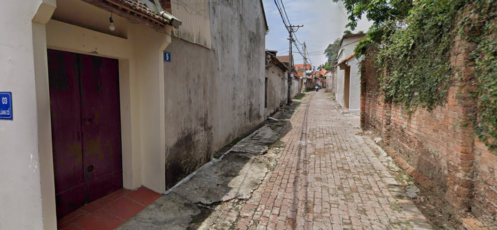
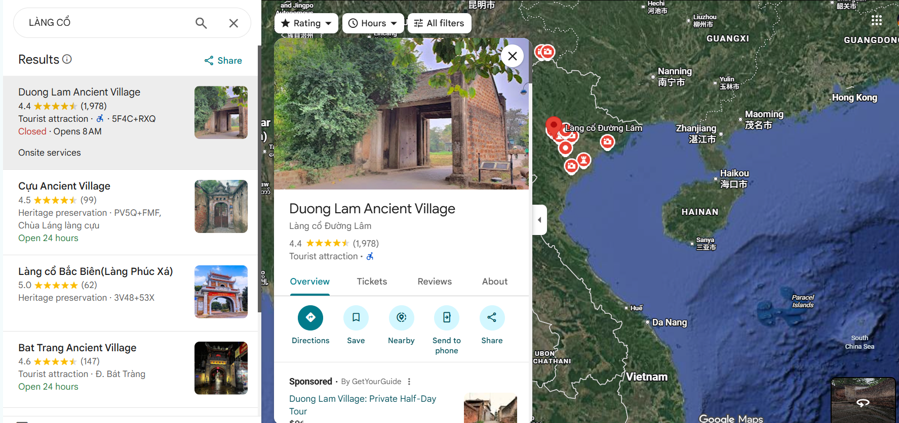
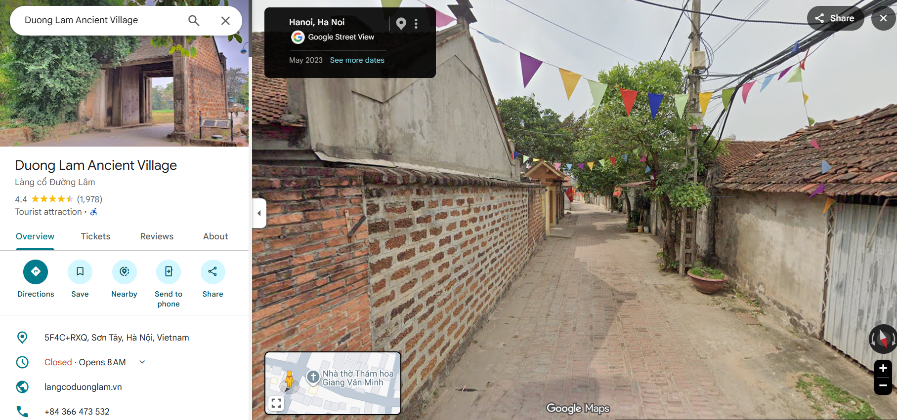
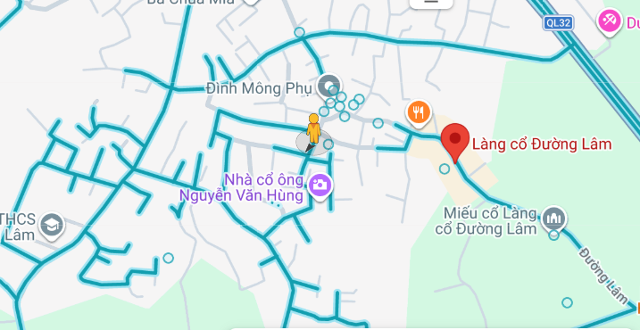
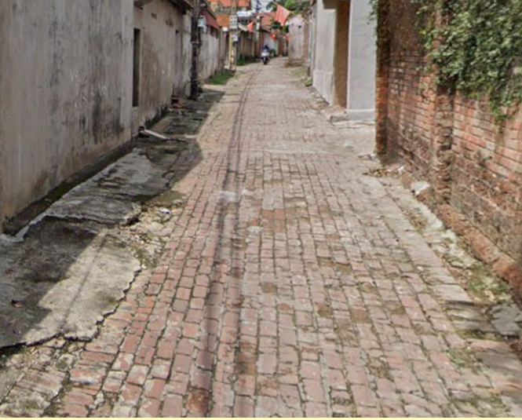
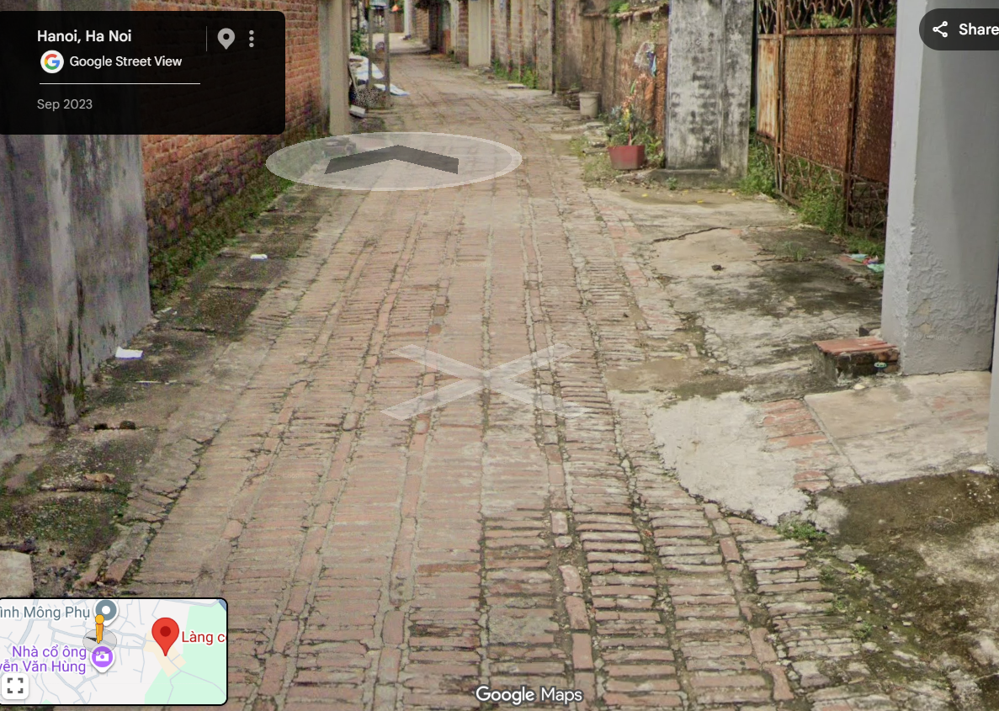
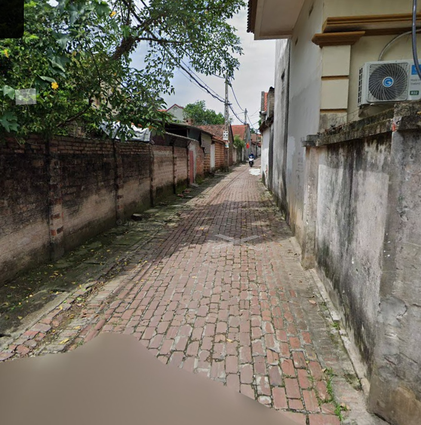
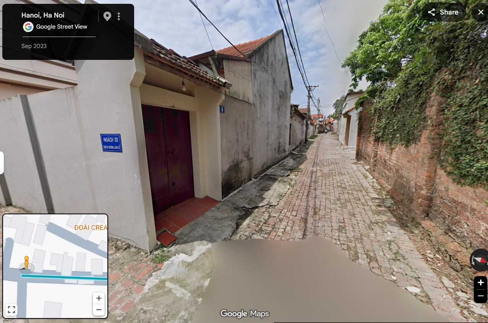
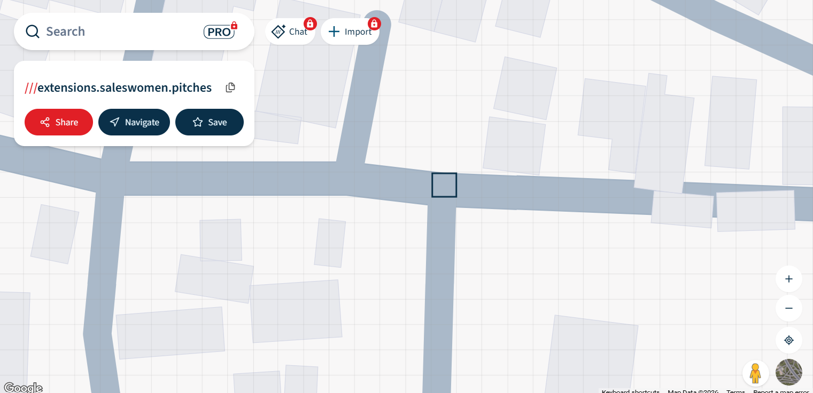

# Town Tour 4
More, more three words!!!
Format: v1t{word1_word2_word3} (3 words in English)
https://what3words.com/

---

## Challenge Image

<p align="center">
  
  <br>
  <em>Original challenge image.</em>
</p>

# Solution

The blue sign in the image says “LÀNG CỔ”, which translates to “ancient village.”

When searching for “LÀNG CỔ”, the first major result was Đường Lâm Ancient Village.
<p align="center">
  
  <br>
</p>

The area around the village seemed to be very similar to the one in the image

<p align="center">
  
  <br>
  <em>A nearby area that looked visually similar to the challenge image.</em>
</p>

However, the area was pretty big, and checking every street would have taken a while.

<p align="center">
  
  <br>
</p>

To narrow it down, I noticed one useful detail: in the challenge image, the floor tiles ran vertically, while on most Google Maps streets nearby, the tiles ran horizontally.
<table>
  <tr>
    <td align="center">
      
      <br>
      <em>Vertical tile direction in the challenge image.</em>
    </td>
    <td align="center">
      
      <br>
      <em>Horizontal tile direction on most nearby streets.</em>
    </td>
  </tr>
</table>

Using that, I was able to narrow it down to this street here 

<p align="center">
  
  <br>
  <em>The street that matched the tile direction clue.</em>
</p>

Continuing on that street led me to this, which matches original challenge image

<p align="center">
  
  <br>
  <em></em>
</p>

From there, it was as simple as copying the coordinates, pasting it into what3words.com, and getting the 3 words

<p align="center">
  
  <br>
  <em>The what3words result for the matched location.</em>
</p>

---

## Flag

```text
v1t{extensions_saleswomen_pitches}
```